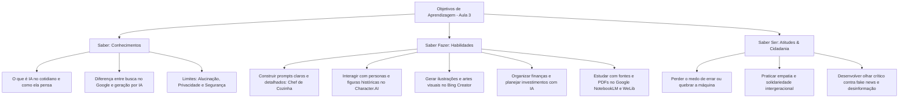
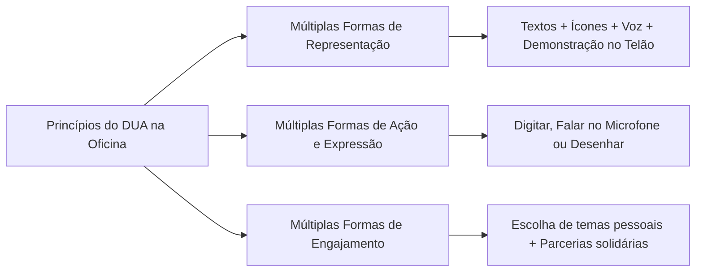

# CURSO EDUCAFRO - INFORMÁTICA BÁSICA & INCLUSÃO DIGITAL
## AULA 3: INTELIGÊNCIA ARTIFICIAL PRÁTICA, INCLUSIVA E COTIDIANA
### Guia Completo do Instrutor e Plano de Aula Presencial (8 Horas: 09h00 às 17h00)
**Elaborado por:** [Leanderson Dias de Lima](https://www.linkedin.com/in/leanderson-dias-de-lima/)

---

## 📌 TABELA DE LINKS RÁPIDOS PARA ACESSO NA AULA

Para facilitar a navegação durante todas as atividades práticas do dia, utilize a tabela abaixo com os links diretos para cada uma das ferramentas gratuitas utilizadas no treinamento:

| Ferramenta / Plataforma | Link Direto de Acesso | Para que serve na aula | Requisito de Acesso |
| :--- | :--- | :--- | :--- |
| **ChatGPT** | [chatgpt.com](https://chatgpt.com) | Assistente de texto | Gratuito (PC e Celular) |
| **DeepSeek** | [deepseek.com/en/](https://www.deepseek.com/en/) | Assistente de texto  Gratuito (PC e Celular) |  Gratuito (PC e Celular) |
| **Google Gemini** | [gemini.google.com](https://gemini.google.com) | Assistente inteligente para pesquisas, orçamentos, receitas e estudos | Gratuito (Conta Gmail) |
| **Character.AI** | [https://character.ai/](https://character.ai/) | Diálogos interativos com personas e personalidades históricas | Gratuito (Navegador) |
| **Bing Image Creator** | [bing.com/create](https://www.bing.com/create) | Criação de fotos, ilustrações, logotipos e cartazes a partir de texto | Gratuito (Conta Microsoft) |
| **WeLib (Biblioteca Livre)** | [https://pt.welib.org/](https://pt.welib.org/) | Download gratuito de livros, apostilas e fontes de estudo em PDF | Gratuito (Sem cadastro) |
| **Google NotebookLM** | [https://notebook.google/?hl=pt-BR](https://notebook.google/?hl=pt-BR) | Caderno inteligente de estudos ancorado em documentos e fontes reais | Gratuito (Conta Google) |
| **Gamma App** | [gamma.app](https://gamma.app) | Criação automática de apresentações de slides e cartilhas em 1 minuto | Gratuito (Conta Google) |

---

## 1. RESUMO EXECUTIVO

| Parâmetro | Especificação do Treinamento |
| :--- | :--- |
| **Curso / Projeto** | EDUCAFRO - Inclusão Digital, Cidadania e Tecnologia Popular |
| **Elaboração / Autoria** | **Leanderson Dias de Lima** ([LinkedIn](https://www.linkedin.com/in/leanderson-dias-de-lima/)) |
| **Módulo** | Aula 3: Inteligência Artificial no Cotidiano - Da Curiosidade à Criação |
| **Carga Horária** | 8 horas presenciais (Turno Matutino: 09h00–12h00 | Turno Vespertino: 13h00–17h00) |
| **Público-Alvo** | Turma heterogênea: Jovens, Adultos, Idosos, Pessoas com TEA (Transtorno do Espectro Autista), Baixa e Alta Alfabetização Digital |
| **Proporção Prática/Teoria** | **75% Prática Ativa / Produção** vs. **25% Exposição Dialogada / Reflexão** (Nenhuma fala contínua > 15-20 min; interação a cada 30 min) |
| **Metodologia Central** | Andragogia (Malcolm Knowles) + Desenho Universal para a Aprendizagem (DUA) + Aprendizagem Baseada em Projetos (PBL) |
| **Entregável Final do Aluno** | **"Portfólio Meu Futuro com IA"**: Receita de bolo e culinária personalizada, diálogo com persona no Character.AI, arte digital no Bing, plano financeiro e caderno de estudos no NotebookLM |
| **Pré-requisitos** | Nenhum conhecimento de programação. Noções básicas de teclado, mouse e navegador (vistas nas Aulas 1 e 2) |
| **Custo de Ferramentas** | **R$ 0,00** (100% ferramentas gratuitas, com acesso direto via navegador, sem necessidade de cadastrar cartão de crédito) |

### 1.1. Propósito Social e Filosofia Pedagógica
A Inteligência Artificial (IA) é frequentemente apresentada sob uma ótica excludente, repleta de jargões técnicos em inglês e promessas distantes da realidade da maioria da população brasileira. Este plano de aula foi construído para romper radicalmente essa barreira: demonstrar que a IA é uma **ferramenta de empoderamento popular, cidadania, aumento de produtividade, organização financeira e democratização do conhecimento**, plenamente acessível para qualquer pessoa, independentemente de idade ou grau de intimidade com a tecnologia.

Na tradição pedagógica da EDUCAFRO, o conhecimento só tem sentido quando liberta e transforma vidas. Por isso, a oficina coloca o participante como protagonista e criador desde o primeiro minuto, transformando o medo da máquina em curiosidade, autonomia e orgulho da própria capacidade.

---

## 2. OBJETIVOS DE APRENDIZAGEM

Estruturados segundo a matriz **CHA** (Conhecimentos, Habilidades e Atitudes), garantindo uma formação técnica, prática e cidadã:



### 2.1. Conhecimentos (Saber)
- **Desmistificação da IA:** Compreender o que é IA generativa através de metáforas cotidianas (ex.: um assistente prestativo que leu milhões de livros e nos ajuda nas tarefas do dia a dia).
- **Conceito de Prompt:** Entender que o computador precisa de instruções claras, detalhadas e contextualizadas para entregar um bom resultado.
- **Pensamento Crítico & Alucinação:** Reconhecer que a IA pode "inventar respostas" com tom convincente quando não possui fontes diretas, entendendo a importância do ser humano como validador final.
- **Privacidade e Proteção de Dados:** Saber identificar quais dados jamais devem ser inseridos em ferramentas públicas (senhas, CPFs, dados bancários, fotos confidenciais).

### 2.2. Habilidades (Saber Fazer)
- **Engenharia de Prompt Descomplicada:** Saber construir comandos detalhados e contextualizados, instruindo a IA como Chef de Cozinha para criar receitas de bolo e cardápios sob medida.
- **Diálogos com Personas:** Navegar no Character.AI para simular conversas instrutivas com personalidades históricas, mentores e grupos de interesse.
- **Criação de Conteúdo Visual:** Gerar ilustrações, personagens, capas e cartazes a partir de comandos em texto no Bing Image Creator.
- **Produtividade Visual:** Criar apresentações completas e cartilhas informativas em menos de dois minutos usando o Gamma App.
- **Inteligência Financeira:** Utilizar assistentes de IA para organizar orçamentos pessoais, identificar cortes de despesas e aprender conceitos de investimentos populares seguros.
- **Pesquisa Ancorada em Fontes:** Baixar materiais no WeLib e utilizar o Google NotebookLM para sintetizar livros e documentos sem erros ou alucinações.

### 2.3. Atitudes (Saber Ser e Convivência)
- **Autonomia Digital:** Sentir segurança para experimentar novas ferramentas por conta própria após a oficina.
- **Colaboração Intergeracional:** Fomentar a troca rica entre a agilidade dos mais jovens e a sabedoria de vida e maturidade dos idosos.
- **Inclusão e Respeito:** Acolher com naturalidade diferentes ritmos de aprendizagem e necessidades sensoriais dos colegas.
- **Cidadania Crítica:** Utilizar a IA para solucionar desafios reais da família, da saúde financeira, dos estudos e de pequenos empreendimentos comunitários.

---

## 3. CRONOGRAMA COMPLETO DA AULA (09h00 às 17h00)

O cronograma organiza o dia em blocos dinâmicos com alternância entre acolhimento, criação prática, pausas sensoriais e momentos de celebração:

| Horário | Módulo / Etapa | Tipo de Atividade | Tempo Teoria | Tempo Prática | Foco Pedagógico & Vivência |
| :--- | :--- | :--- | :---: | :---: | :--- |
| **09:00 - 09:30** (30 min) | **Abertura & Conexão** | Dinâmica Acolhedora | 5 min | 25 min | Boas-vindas, pacto de convivência e dinâmica "Onde a IA já mora no meu dia?" |
| **09:30 - 10:15** (45 min) | **Módulo 1: O Assistente Pessoal** | Prática Guiada + Duplas | 10 min | 35 min | Primeiro contato com ChatGPT & Gemini: conversas cotidianas e digitação por voz |
| **10:15 - 10:30** (15 min) | ☕ **Pausa Sensorial & Café** | Intervalo Ativo | 0 min | 0 min | Café, descompressão sensorial, banheiro e descanso visual de telas |
| **10:30 - 11:15** (45 min) | **Módulo 2: O Segredo do Prompt & Chef IA** | Dinâmica + Mão na Massa | 10 min | 35 min | Como pedir certo: transformando a IA em Chef Confeiteiro para receitas de bolo e culinária |
| **11:15 - 12:00** (45 min) | **Módulo 3: Personagens & Diálogos Vivos** | Vivência Interativa | 10 min | 35 min | Character.AI: dialogando com figuras históricas, mentores e personagens de interesse |
| **12:00 - 13:00** (60 min) | 🍽️ **Almoço & Descompressão** | Pausa Livre | 0 min | 0 min | Alimentação, convivência, caminhada leve e descanso |
| **13:00 - 13:45** (45 min) | **Módulo 4: O Estúdio de Arte Mágico** | Laboratório Visual | 10 min | 35 min | Bing Image Creator: gerando fotos, ilustrações, logos e cartazes com palavras |
| **13:45 - 14:30** (45 min) | **Módulo 5: Slides em 1 Minuto** | Produtividade Visual | 10 min | 35 min | Gamma App: criando apresentações completas e cartilhas informativas para projetos |
| **14:30 - 15:15** (45 min) | **Módulo 6: Finanças & Investimentos com IA** | Planejamento Prático | 10 min | 35 min | ChatGPT & Gemini: organização do orçamento familiar, metas de economia e investimentos simples |
| **15:15 - 15:30** (15 min) | 🍎 **Pausa da Tarde & Alongamento** | Pausa Ativa | 0 min | 0 min | Hidratação, lanche leve e alongamento guiado dos punhos e ombros |
| **15:30 - 16:30** (60 min) | **Módulo 7: Estudos com Fontes & WeLib** | Pesquisa Confiável | 10 min | 50 min | Google NotebookLM + WeLib: criando cadernos de estudo com livros e PDFs sem alucinações |
| **16:30 - 17:00** (30 min) | **Módulo 8: Feira de Conquistas & Celebração** | Showcase + Roda Ética | 5 min | 25 min | Apresentação dos projetos, reflexão ética, entrega do Guia de Bolso e encerramento |
| **TOTAL** | **8 Horas (480 minutos)** | **100% Inclusivo** | **70 min (~15%)** | **320 min (~67% prática + 90 min pausas)** | **Experiência prática memorável** |

---

## 4. DESCRIÇÃO DETALHADA DE CADA ATIVIDADE

---

### ATIVIDADE 1: O Detetive de IA - "Onde a Máquina já Vive Comigo?"
* **Tempo:** 30 minutos (09h00 - 09h30)
* **Objetivo:** Acolher a turma, reduzir a ansiedade diante da tecnologia e identificar a presença da IA no cotidiano de forma desmistificada.
* **Materiais:** Lousa/Flipchart com canetões coloridos, cartões adesivos (Post-its) de cores variadas, projetor com slide visual de acolhimento.
* **Instruções para o Professor:**
  1. Receba cada aluno na porta com um cumprimento acolhedor e entregue 2 post-its coloridos.
  2. Apresente-se de forma humanizada (nome, trajetória e por que está feliz por estar ali com a EDUCAFRO).
  3. Lance a pergunta disparadora em tom de conversa: *"Quem aqui usou o celular hoje para ouvir música, ver vídeo, pedir transporte, usar o banco ou mandar áudio?"*
  4. Explique em 2 minutos: *"A Inteligência Artificial não é um robô de filme de ficção que quer dominar o mundo. Ela é como um ajudante muito rápido que aprendeu lendo milhões de exemplos na internet, mas só faz algo se a gente souber pedir!"*
  5. Proponha a dinâmica: Peça para cada um escrever ou desenhar no papel uma tarefa chata ou repetitiva do dia a dia que adoraria delegar para um assistente robô. Cole no grande painel da sala.
* **Instruções para os Alunos:**
  - "Pegue o seu papelzinho colorido. Escreva ou faça um desenho simples: Se você tivesse um assistente digital mágico trabalhando para você de graça, que tarefa você pediria para ele resolver?"
  - Exemplos: *'Fazer a lista de compras', 'Escrever mensagem formal para o chefe', 'Organizar as contas da casa', 'Lembrar da hora dos remédios'.*
* **Versão Individual:** Escrever/desenhar no seu cartão e colar no mural.
* **Versão Colaborativa (Duplas):** Conversar com o colega de mesa e descobrir uma tarefa que os dois gostariam de automatizar.
* **Adaptações para TEA:**
  - Cronograma visual fixado na lousa com caixas de marcação.
  - Participação na dinâmica oral totalmente voluntária (quem preferir não falar em público pode apenas colar o post-it no mural silenciosamente).
  - Ambiente com luminosidade suave e sem ruídos altos.
* **Adaptações para Idosos:**
  - Cartões com tamanho generoso e canetas hidrográficas de traço grosso.
  - Validação calorosa de cada relato de vida trazido para a sala.
  - Sem pressa no tempo de escrita.
* **Desafios Avançados:** Pedir para o aluno identificar exemplos de IA tradicional (regras fixas) vs. IA que aprende padrões no seu próprio celular (ex.: sugestão de palavras no teclado).
* **Critério de Sucesso:** Todos os participantes colaram seus desejos no mural e relataram sentir-se acolhidos e tranquilos na sala.
* **Resultado Esperado:** Mural coletivo colorido e quebra do receio inicial em relação à tecnologia.

---

### ATIVIDADE 2: Meu Primeiro Papo com o Robô Amigo (ChatGPT & Gemini)
* **Tempo:** 45 minutos (09h30 - 10h15)
* **Objetivo:** Acessar um assistente de IA pela primeira vez, realizar perguntas em linguagem natural e experimentar a funcionalidade de digitação por voz.
* **Materiais:** Computador com navegador aberto em [chatgpt.com](https://chatgpt.com) ou [gemini.google.com](https://gemini.google.com), ou smartphone conectado ao Wi-Fi.
* **Instruções para o Professor:**
  1. Projete a tela do navegador com fonte bem grande (Zoom em 125% com `Ctrl` + `+`). Mostre a caixa de texto e compare: *"É exatamente como mandar uma mensagem no WhatsApp para um amigo prestativo que sabe receitas, histórias, consertos e matérias escolares."*
  2. Execute 3 exemplos ao vivo no projetor:
     - 🍲 *"Sugira 3 opções de jantar econômico usando apenas o que sobrou na geladeira: arroz cozido, ovos e tomate."*
     - 💡 *"Explique como funciona a energia solar como se eu fosse uma criança de 7 anos."*
     - 📱 *"Escreva uma mensagem educada de WhatsApp avisando que vou me atrasar 15 minutos para a reunião de família."*
  3. Mostre o ícone de microfone (para quem tem dificuldade em digitar).
  4. Circule pela sala auxiliando quem estiver com dificuldade de login ou clique.
* **Instruções para os Alunos:**
  - "Abra o assistente na sua tela.
  - Escreva ou fale no microfone 3 pedidos simples da sua rotina:
    1. Uma receita com ingredientes que você tem na sua casa.
    2. Uma dúvida prática sobre saúde, plantas, consertos ou direitos.
    3. Uma mensagem de agradecimento carinhosa para alguém especial da sua vida."
* **Versão Individual:** O aluno explora suas próprias curiosidades diretamente na ferramenta.
* **Versão Colaborativa (Dupla Solidária):** Um colega dita a dúvida e o outro pilota a digitação ou aciona o microfone, rindo e lendo as respostas juntos.
* **Adaptações para TEA:**
  - Guia impresso com a imagem do botão exato onde clicar (caixa de texto, microfone e tecla Enter).
  - Disponibilidade de fones de ouvido para foco individual.
* **Adaptações para Idosos:**
  - Estimular prioritariamente a digitação por voz para evitar cansaço nas mãos.
  - Apoio direto no clique do mouse para enviar a mensagem.
* **Desafios Avançados:** Pedir para a IA traduzir a mensagem para outro idioma (ex.: Espanhol ou Inglês) ou reescrever a resposta em forma de poesia rimada.
* **Critério de Sucesso:** Aluno digitou ou falou ao menos 1 comando e leu a resposta gerada na tela.
* **Resultado Esperado:** Olhos brilhando na sala, sorrisos de surpresa e desmistificação completa do medo do computador.

---

### ATIVIDADE 3: A Fábrica de Pedidos Perfeitos - O Chef de Cozinha com IA & A Arte do Prompt
* **Tempo:** 45 minutos (10h30 - 11h15)
* **Objetivo:** Dominar a estrutura fundamental de um bom prompt (clareza, contexto e detalhes), transformando a IA em um Chef de Cozinha e Mestre Confeiteiro para criar receitas perfeitas de bolo e culinária personalizada.
* **Materiais:** [chatgpt.com](https://chatgpt.com) ou [gemini.google.com](https://gemini.google.com).
* **Instruções para o Professor:**
  1. Demonstre a diferença crucial entre um pedido vago e um pedido detalhado e contextualizado:
     - ❌ **Pedido Vago:** *"Me passa uma receita de bolo."* (A IA entrega algo genérico e sem detalhes).
     - ✅ **Pedido Detalhado e Claro:** *"Aja como um renomado Chef Confeiteiro. Crie uma receita detalhada de bolo de chocolate fofinho com cobertura cremosa, para uma pessoa iniciante na cozinha, usando medidas em xícaras e explicando os segredos para a massa não solar."*
  2. Apresente na lousa os 4 segredos para um pedido perfeito:
     - 🎭 **Quem a IA deve ser:** Definir a profissão/papel *(Ex: "Aja como um Chef de Cozinha paciente e mestre confeiteiro")*
     - 🎯 **O que ela deve fazer:** O prato ou receita exata *(Ex: "Crie a receita completa de um bolo de cenoura com cobertura crocante")*
     - 👥 **Para quem é:** O público e a ocasião *(Ex: "Para um iniciante que vai fazer o lanche da família")*
     - 📏 **Como deve ser a resposta:** Os detalhes importantes *(Ex: "Ingredientes em xícaras/colheres, passo a passo numerado e 3 dicas de chef para não errar")*
  3. Incentive a turma a experimentar variações de bolos e receitas afetivas (bolo de fubá da vovó, bolo sem lactose, bolo de milho de lata, bolo econômico de caneca).
* **Instruções para os Alunos:**
  - "Hoje você vai contratar um Chef de Confeitaria internacional de graça no seu computador!
  - Vamos construir o seu pedido com todos os detalhes:
    1. Peça para a IA agir como um Chef de Confeitaria premiado e atencioso.
    2. Peça a receita do seu bolo favorito (chocolate, cenoura, fubá, laranja, milho) ou informe o que tem no armário.
    3. Diga para quem é o bolo (para as crianças, para vender pedaços no bairro, para um café da tarde).
    4. Peça o tempo exato de forno, medidas em xícaras e o segredo de vó para a massa ficar bem fofinha!
  - Se faltar algum ingrediente na sua casa, diga para o Chef: *'Não tenho leite, o que posso usar no lugar?'* e veja ele adaptar na hora!"
* **Versão Individual:** Cada aluno cria a sua receita de bolo personalizada e salva o texto.
* **Versão Colaborativa:** Em duplas, um aluno escolhe os ingredientes favoritos e o outro monta a instrução detalhada no computador.
* **Adaptações para TEA:**
  - Cartão estruturado tipo formulário com 4 caixas (Quem a IA é: [ ], O que fazer: [ ], Para quem: [ ], Detalhes: [ ]). A lógica sequencial reduz a sobrecarga de escolhas.
* **Adaptações para Idosos:**
  - Conectar com a culinária afetiva e tradicional (bolos de milho, fubá cremoso, bolo de laranja).
  - Exemplos com letras grandes impressos para servir de guia.
* **Desafios Avançados:** Pedir para a IA calcular o custo aproximado dos ingredientes e sugerir o preço ideal de venda por fatia para gerar renda extra.
* **Critério de Sucesso:** Aluno construiu um prompt detalhado e gerou uma receita de bolo completa, testando uma pergunta de substituição de ingredientes.
* **Resultado Esperado:** Alunos empolgados compartilhando as receitas criadas e compreendendo que a precisão da resposta depende da qualidade do comando.

---

### ATIVIDADE 4: Diálogos com a História e Personas Vivas (Character.AI)
* **Tempo:** 45 minutos (11h15 - 12h00)
* **Objetivo:** Experimentar o poder das personas de Inteligência Artificial para interagir com personalidades históricas, autores da literatura, mentores e figuras de interesse cultural, estimulando o letramento crítico, a imaginação e a contextualização histórica.
* **Materiais:** Acesso a [https://character.ai/](https://character.ai/) via navegador.
* **Instruções para o Professor:**
  1. Projete o site [character.ai](https://character.ai/) no telão e explique o conceito de **Persona de IA**: *"Uma persona é quando a IA assume a personalidade, o vocabulário, as memórias e a forma de pensar de uma pessoa famosa, autor de livro ou personagem histórico."*
  2. Faça uma demonstração rápida ao vivo:
     - Pesquise por uma figura marcante da história e literatura brasileira (ex: *Carolina Maria de Jesus*, *Machado de Assis*, *Zumbi dos Palmares* ou *Albert Einstein*).
     - Inicie uma conversa com uma pergunta respeitosa e curiosa: *"Dona Carolina, o que a senhora diria para os jovens da periferia que sonham em escrever livros hoje?"*
     - Mostre como a IA responde adotando o estilo e o vocabulário característico da figura.
  3. Destaque o ponto crítico de segurança e realidade: *"Lembrem-se: a IA está simulando a forma como essa pessoa falaria com base nos textos que ela deixou. Não é uma pessoa real do outro lado!"*
* **Instruções para os Alunos:**
  - "Vamos fazer uma viagem no tempo e conversar com quem você sempre quis conhecer!
  - 1. Acesse o site [https://character.ai/](https://character.ai/).
  - 2. Na barra de busca, digite o nome de alguém que você admira (um escritor, cientista, líder histórico, mentor profissional ou personagem).
  - 3. Faça 3 perguntas sobre a vida dessa personalidade:
     - Como foi superar as dificuldades da sua época?
     - Que conselho você daria para o meu dia a dia?
     - Como você enxerga a tecnologia e o futuro da humanidade?
  - 4. Observe como a forma de falar é diferente de acordo com quem você escolheu!"
* **Versão Individual:** O aluno escolhe livremente uma figura histórica ou personagem com quem gostaria de conversar.
* **Versão Colaborativa:** Em duplas, os alunos simulam uma 'entrevista jornalística' com o personagem escolhido, combinando as perguntas antes de digitar.
* **Adaptações para TEA:**
  - Excelente oportunidade de conexão com temas de hiperfoco (personagens favoritos de literatura, física, astronomia, história ou jogos).
  - Alerta explícito de previsibilidade: reforçar com clareza a natureza matemática e simulada da persona para evitar confusão entre ficção e realidade.
* **Adaptações para Idosos:**
  - Estímulo para conversar com figuras históricas marcantes do Brasil e do mundo que fizeram parte de sua juventude e formação.
  - Apoio na busca e digitação das perguntas.
* **Desafios Avançados:** Avaliar criticamente a resposta: *"A persona usou palavras da época correta? Que fato histórico real ela mencionou?"*.
* **Critério de Sucesso:** Aluno localizou uma persona de interesse, realizou pelo menos 2 perguntas e refletiu sobre o estilo de resposta.
* **Resultado Esperado:** Admiração e encantamento na sala ao verem personagens históricos 'ganharem vida' para um bate-papo educativo e reflexivo.

---

### ATIVIDADE 5: O Estúdio de Arte Mágico (Bing Image Creator / Microsoft Designer)
* **Tempo:** 45 minutos (13h00 - 13h45)
* **Objetivo:** Gerar imagens visuais, ilustrações artísticas, cartazes e logotipos a partir de prompts descritivos detalhados.
* **Materiais:** Acesso a [bing.com/create](https://www.bing.com/create) (Microsoft Designer).
* **Instruções para o Professor:**
  1. Aqueça a sala no retorno do almoço projetando o navegador e mostrando como frases detalhadas viram quadros e fotos de altíssima qualidade.
  2. Apresente a fórmula visual: **Sujeito + O que está fazendo + Cenário + Estilo Artístico + Iluminação / Cores**.
     - Exemplo 1: *"Uma mulher negra idosa sorridente, lendo um livro dourado em um jardim ensolarado com flores coloridas, estilo pintura a óleo clássica."*
     - Exemplo 2: *"Logotipo moderno para uma confeitaria artesanal chamada 'Sabor & Carinho', cores suaves, desenho minimalista em vetor, fundo branco."*
     - Exemplo 3: *"Um jovem estudando no computador em uma comunidade brasileira alegre ao pôr do sol, estilo animação 3D."*
  3. Ensine o passo a passo para salvar a imagem no computador (botão direito -> 'Salvar imagem como...').
* **Instruções para os Alunos:**
  - "Agora você é o artista da sala!
  - Crie uma imagem incrível:
    1. Uma ilustração para presentear alguém da família (filhos, netos, amigos).
    2. O logotipo ou a fachada do negócio dos seus sonhos (sua confeitaria, oficina, salão de beleza).
    3. Uma arte que represente a sua história, suas raízes ou sua ancestralidade.
  - Experimente estilos: 'Foto realista', 'Desenho animado 3D', 'Aquarela suave'."
* **Versão Individual:** Criar 3 imagens com estilos visuais diferentes e baixar a sua preferida.
* **Versão Colaborativa:** "O Retrato da Amizade": Um aluno descreve como imagina a capa do livro autobiográfico do colega e o outro gera a imagem na tela!
* **Adaptações para TEA:**
  - Estímulo à criação com base em temas de interesse especial do participante (ex.: astronomia, trens, animais, botânica).
  - Alerta de previsibilidade: avisar que a ferramenta leva cerca de 20 a 30 segundos pensando antes de exibir as 4 opções de imagem.
* **Adaptações para Idosos:**
  - Apoio paciente no manuseio do mouse para clicar com o botão direito e salvar na pasta 'Imagens' ou 'Downloads'.
  - Estímulo a resgatar imagens afetivas do passado (sua terra natal, celebrações de família).
* **Desafios Avançados:** Especificar termos de fotografia e iluminação (ex.: *"iluminação cinematográfica dourada, ângulo aberto, riqueza de detalhes"*).
* **Critério de Sucesso:** Aluno gerou e salvou no mínimo 1 imagem digital autoral de boa qualidade no computador.
* **Resultado Esperado:** Galeria visual deslumbrante na sala, comemoração dos alunos ao verem suas ideias desenhadas na tela.

---

### ATIVIDADE 6: Apresentações e Documentos Visuais em 1 Minuto (Gamma App)
* **Tempo:** 45 minutos (13h45 - 14h30)
* **Objetivo:** Gerar apresentações completas de slides, páginas web e cartilhas com design profissional e diagramação automática a partir de um único tema.
* **Materiais:** Acesso a [gamma.app](https://gamma.app) (plano gratuito via navegador).
* **Instruções para o Professor:**
  1. Projete o Gamma App no telão. Clique em *'New with AI'* -> *'Generate'*.
  2. Digite um tema comunitário real e inspirador: *"Guia Prático: Como Começar a Empreender com Pouco Dinheiro"*.
  3. Deixe a sala acompanhar a IA construindo em 30 segundos uma sequência de 8 slides visualmente impecáveis, com cartões, títulos, ícones e cores coordenadas.
  4. Mostre como clicar em qualquer texto para editar e personalizar as informações.
* **Instruções para os Alunos:**
  - "Transforme suas ideias em uma apresentação de causar impacto!
  - Escolha um tema:
    - Um projeto social para seu bairro, associação de moradores ou igreja.
    - A apresentação do seu produto, serviço ou confeitaria para conquistar clientes.
    - Uma aula sobre algo que você ama fazer (culinária, jardinagem, costura, marcenaria).
  - Digite no Gamma, escolha um tema de cores elegante e veja seus slides prontos!"
* **Versão Individual:** Criação de uma apresentação autoral sobre seu projeto ou ideias de vida.
* **Versão Colaborativa:** Em duplas, planejar e gerar uma proposta de melhoria comunitária (ex: reforma de quadra de esportes, horta comunitária).
* **Adaptações para TEA:**
  - Temas estruturados com orientações pontuais; visual limpo e sem poluição de abas abertas.
  - Reforçar que a IA só cria o rascunho inicial e que o aluno tem total controle para editar no seu ritmo.
* **Adaptações para Idosos:**
  - Enfatizar o alívio: *"Chega de passar horas tentando alinhar caixas de texto no computador! A IA faz a diagramação pesada para você."*
  - Escolha de temas ligados às suas histórias e saberes populares.
* **Desafios Avançados:** Modificar a disposição dos cartões para layouts em grade (*cards layout*), inserir imagens geradas no Bing e exportar em PDF.
* **Critério de Sucesso:** Aluno gerou uma apresentação completa no Gamma, testou a exibição em modo tela cheia e editou ao menos 1 texto.
* **Resultado Esperado:** Sentimento profundo de capacidade profissional e surpresa com a beleza estética dos materiais gerados.

---

### ATIVIDADE 7: Inteligência Financeira & Planejamento de Investimentos com IA
* **Tempo:** 45 minutos (14h30 - 15h15)
* **Objetivo:** Utilizar a IA generativa como consultora e organizadora financeira pessoal, aprendendo a estruturar o orçamento doméstico, identificar oportunidades de economia, definir metas de poupança e entender os fundamentos dos investimentos seguros (Tesouro Direto, CDB, Renda Fixa) em linguagem simples e descomplicada.
* **Materiais:** [chatgpt.com](https://chatgpt.com) ou [gemini.google.com](https://gemini.google.com), folha de anotações financeiras.
* **Instruções para o Professor:**
  1. Quebre o tabu sobre finanças: *"Falar de dinheiro não precisa ser difícil nem assustador. A IA é uma calculadora inteligente e paciente que nos ajuda a organizar cada centavo e planejar um futuro melhor."*
  2. Apresente 3 missões financeiras práticas no projetor:
     - 📊 **Missão 1 (Orçamento Doméstico):** Organizar uma renda mensal hipotética (ex: R$ 2.000) na regra simples dos 50-30-20 (50% necessidades básicas, 30% qualidade de vida, 20% reserva do futuro).
     - 🎯 **Missão 2 (Corte de Gastos Invisíveis & Meta):** Como juntar R$ 500 em 5 meses cortando pequenos desperdícios do dia a dia.
     - 📈 **Missão 3 (Investimentos Descomplicados):** Explicar a diferença entre Poupança, Tesouro Selic e CDB de forma fácil para quem nunca investiu.
  3. Conduza um alerta rigoroso de segurança: *"Atenção: Nunca digite sua senha de banco, número de conta ou CPF na IA. Usamos valores gerais para fazer simulações!"*
* **Instruções para os Alunos:**
  - "Vamos colocar as contas em ordem e planejar o seu futuro financeiro!
  - 1. Abra o ChatGPT ou Gemini e envie um comando como:
     - *'Aja como um educador financeiro popular e paciente. Ganho R$ [valor aproximado] por mês. Ajude-me a montar uma tabela simples de gastos fixos, variáveis e quanto devo guardar por mês.'*
  - 2. Peça um plano de economia:
     - *'Quero juntar R$ [valor] até o final do ano para uma emergência. Dê 5 dicas práticas de economia para a minha rotina.'*
  - 3. Peça para o robô explicar investimentos:
     - *'Explique o que é Tesouro Direto e CDB como se estivesse explicando para alguém da minha família que nunca investiu, comparando com a poupança.'*"
* **Versão Individual:** O aluno monta sua própria simulação orçamentária e plano de metas.
* **Versão Colaborativa:** Em duplas, os alunos trocam ideias sobre estratégias populares de economia doméstica e simulam juntos as melhores dicas.
* **Adaptações para TEA:**
  - Apresentação dos dados em formato de tabela organizada com colunas claras (Categoria, Valor, Porcentagem).
  - Regras matemáticas diretas sem ambiguidades.
* **Adaptações para Idosos:**
  - Foco em proteção contra golpes financeiros (empréstimos consignados abusivos, links suspeitos de banco).
  - Linguagem clara sem "economês" (termos técnicos explicados de forma simples e acolhedora).
* **Desafios Avançados:** Pedir para a IA calcular quanto renderia guardar R$ 50 por mês durante 2 anos em uma aplicação de renda fixa com juros compostos.
* **Critério de Sucesso:** Aluno gerou uma tabela de orçamento organizada e recebeu uma explicação clara sobre investimentos básicos seguros.
* **Resultado Esperado:** Sensação de alívio e clareza sobre organização financeira, quebra de medos sobre investimentos e maior controle sobre a renda familiar.

---

### ATIVIDADE 8: O Caderno Inteligente de Estudos - Pesquisa com Fontes Confiáveis (Google NotebookLM & WeLib)
* **Tempo:** 60 minutos (15h30 - 16h30)
* **Objetivo:** Aprender a usar o **Google NotebookLM** como assistente de estudos confiável e ancorado em fontes reais, eliminando o risco de alucinações. Os alunos aprenderão a pesquisar e baixar livros/materiais gratuitos no portal **WeLib** ([https://pt.welib.org/](https://pt.welib.org/)), subir os arquivos para o NotebookLM e gerar resumos, perguntas e respostas e roteiros de estudo a partir de documentos de seu interesse.
* **Materiais:** Acesso a [https://notebook.google/?hl=pt-BR](https://notebook.google/?hl=pt-BR) e [https://pt.welib.org/](https://pt.welib.org/), conta Google conectada.
* **Instruções para o Professor:**
  1. Explique a grande inovação do NotebookLM: *"Ao contrário do ChatGPT comum que busca em toda a internet e às vezes inventa respostas, o Google NotebookLM é um 'caderno inteligente' que só responde aquilo que está escrito nos livros e documentos que VOCÊ colocar dentro dele! Ele sempre cita a página e o trecho exato da fonte."*
  2. Demonstre o fluxo completo no telão (10 min):
     - Acesse o [https://pt.welib.org/](https://pt.welib.org/) (Biblioteca Livre em Português).
     - Busque um tema de interesse comum (ex: Cidadania, Direitos do Consumidor, História Afro-brasileira, Saúde Comunitária ou Culinária) e baixe um arquivo em PDF gratuito.
     - Acesse o [https://notebook.google/?hl=pt-BR](https://notebook.google/?hl=pt-BR) e clique em *'Novo Notebook'*.
     - Faça o upload do PDF baixado.
     - Mostre a mágica: em segundos o NotebookLM gera um resumo do livro e sugestões de perguntas.
     - Faça uma pergunta para a IA e mostre como ela coloca o número da citação com o trecho do documento original.
  3. Oriente os alunos a criarem seu próprio caderno temático.
* **Instruções para os Alunos:**
  - "Vamos criar o seu próprio Caderno de Estudos com Inteligência Artificial!
  - 1. Acesse o site [https://pt.welib.org/](https://pt.welib.org/) e pesquise um livro, apostila ou artigo sobre um tema que você adora ou precisa estudar (história, direitos, saúde, artesanato, empreendedorismo). Baixe o arquivo PDF.
  - 2. Abra o [https://notebook.google/?hl=pt-BR](https://notebook.google/?hl=pt-BR) com sua conta Google e crie um novo caderno.
  - 3. Suba o arquivo PDF que você baixou.
  - 4. Veja o resumo que ele preparou e faça 3 perguntas sobre o conteúdo:
     - *'Quais são os 5 pontos mais importantes deste livro?'*
     - *'Crie um questionário de 3 perguntas com respostas para eu testar meu aprendizado sobre este assunto.'*
     - *'Explique o capítulo principal em uma linguagem simples para quem está começando.'*"
* **Versão Individual:** Cada participante monta seu caderno de estudos focado no seu tema de interesse pessoal ou profissional.
* **Versão Colaborativa:** Em duplas, os colegas sobem o mesmo documento e comparam as perguntas e descobertas que cada um fez.
* **Adaptações para TEA:**
  - Pasta 'Fontes Prontas' na Área de Trabalho com PDFs já selecionados (ciência, história, natureza) para quem não quiser realizar a etapa de download no WeLib.
  - O sistema de citações diretas do NotebookLM traz previsibilidade e segurança de que o robô não está inventando nada fora do texto.
* **Adaptações para Idosos:**
  - Apoio passo a passo na transição entre o WeLib (baixar) e o NotebookLM (subir arquivo).
  - Sugestão de temas voltados para direitos da pessoa idosa (Estatuto da Pessoa Idosa), plantas medicinais ou memórias brasileiras.
* **Desafios Avançados:** Adicionar múltiplas fontes ao mesmo caderno (ex: 2 PDFs diferentes sobre o mesmo assunto) e pedir para o NotebookLM comparar os pontos de vista dos dois autores.
* **Critério de Sucesso:** Aluno realizou o upload de pelo menos 1 documento no NotebookLM e gerou respostas baseadas na fonte com citações visíveis.
* **Resultado Esperado:** Alunos empoderados com uma ferramenta fantástica para estudar para concursos, cursos, trabalhos e interesses cotidianos com fontes 100% seguras.

---

### ATIVIDADE 9: Feira de Conquistas, Reflexão Ética, Segurança Digital & Celebração Final
* **Tempo:** 30 minutos (16h30 - 17h00)
* **Objetivo:** Apresentar as criações do dia, praticar o reconhecimento mútuo, consolidar noções de ética, direitos e segurança na era da IA e encerrar a oficina com entusiasmo e fortalecimento da autoestima.
* **Materiais:** Projetor para exibição rápida voluntária, Guia Rápido de Bolso impresso para entrega individual.
* **Instruções para o Professor:**
  1. Conduza uma rodada de *Showcase Relâmpago* (15 min): convide voluntários para compartilhar sua receita de bolo personalizada, sua imagem criada no Bing, sua apresentação no Gamma, seu plano de economia ou seu caderno no NotebookLM.
  2. Puxe uma breve conversa ética e cidadã de 5 minutos sobre responsabilidade digital:
     - *"A máquina não tem coração nem ética; quem tem é você! Use a IA para criar coisas boas, espalhar a verdade e apoiar sua comunidade."*
     - *"Atenção contra Fake News e Deepfakes: se receber um vídeo, áudio ou texto estranho nas redes, desconfie, cheque em fontes confiáveis como o WeLib e nunca passe adiante sem ter certeza."*
     - *"Privacidade é direito sagrado: nunca coloque dados sensíveis seus ou de terceiros em ferramentas abertas."*
  3. Realize uma calorosa salva de palmas coletiva e entregue o Guia de Bolso impresso para cada aluno.
* **Instruções para os Alunos:**
  - "Venha compartilhar com orgulho o que você criou hoje!
  - Veja o quanto você aprendeu em apenas 8 horas: de iniciante a criador de receitas, artes, apresentações, finanças organizadas e pesquisas com Inteligência Artificial!"
* **Versão Individual:** O participante salva seus arquivos no e-mail, nuvem ou pen drive para levar para casa.
* **Versão Colaborativa:** Toda a turma celebra e aplaude as apresentações dos colegas em clima de união e fraternidade.
* **Adaptações para TEA:**
  - Exibição estritamente voluntária. O professor pode projetar o trabalho em silêncio sem que o aluno precise falar em público caso não queira.
* **Adaptações para Idosos:**
  - Garantir que os links e materiais foram salvos para que possam mostrar com orgulho para seus filhos, netos e amigos.
  - Homenagem especial pela perseverança, pioneirismo e coragem de aprender.
* **Desafios Avançados:** Propor um compromisso multiplicador: ensinar pelo menos 1 pessoa da família ou do bairro a usar o ChatGPT para receitas ou finanças na próxima semana.
* **Critério de Sucesso:** 100% dos alunos finalizam o dia com autoestima fortalecida, compreendendo os limites éticos da IA e com produtos concretos criados por suas próprias mãos.
* **Resultado Esperado:** Emoção, empoderamento popular, aplausos e desejo unânime de continuar estudando tecnologia na EDUCAFRO.

---

## 5. FERRAMENTAS DE IA RECOMENDADAS (100% GRATUITAS & SEM CARTÃO)

Todas as ferramentas selecionadas atendem rigorosamente aos critérios: **Versão gratuita funcional no Brasil, acesso direto pelo navegador, sem necessidade de cadastrar cartão de crédito e adequadas para iniciantes**.

| Categoria | Ferramenta | Link Direto | O que faz em 1 frase simples | Requisitos / Acesso | Sugestão de Atividade Curta (5-10 min) |
| :--- | :--- | :--- | :--- | :--- | :--- |
| **Assistente & Texto** | **ChatGPT** | [chatgpt.com](https://chatgpt.com) | Um assistente inteligente que conversa, cria textos, ensina receitas personalizadas e dá conselhos. | Funciona em PC e Celular (Conta Google/E-mail) | Pedir uma receita de bolo fofinho com 3 ingredientes ou um plano de corte de gastos. |
| **Assistente & Pesquisa** | **Google Gemini** | [gemini.google.com](https://gemini.google.com) | O assistente do Google que busca informações atualizadas na internet e organiza orçamentos. | Login direto com conta Gmail existente | Organizar uma renda de R$ 1.800 na regra 50-30-20 e sugerir metas de poupança. |
| **Personas & Diálogos** | **Character.AI** | [https://character.ai/](https://character.ai/) | Permite conversar com personas de personalidades históricas, autores e mentores em tempo real. | Acesso gratuito direto no navegador | Entrevistar Carolina Maria de Jesus ou Machado de Assis sobre a importância da leitura. |
| **Geração de Imagens** | **Bing Image Creator (Designer)** | [bing.com/create](https://www.bing.com/create) | Desenha qualquer imagem, foto ou ilustração que você descrever com palavras em segundos. | Conta Microsoft (Hotmail/Outlook gratuita) | Criar o logotipo dos seus sonhos para uma confeitaria ou serviço comunitário. |
| **Biblioteca Livre** | **WeLib** | [https://pt.welib.org/](https://pt.welib.org/) | Portal gratuito para pesquisar e baixar livros, artigos e apostilas em formato PDF. | Acesso gratuito e direto sem cadastro obrigatório | Baixar um livro sobre cidadania ou saúde para usar no NotebookLM. |
| **Caderno de Estudos com Fontes** | **Google NotebookLM** | [https://notebook.google/?hl=pt-BR](https://notebook.google/?hl=pt-BR) | Caderno inteligente que resume e responde dúvidas ancorado estritamente em PDFs e fontes enviadas. | Conta Google (gratuito) | Subir uma apostila em PDF e pedir um questionário de 5 perguntas para estudar. |
| **Apresentações & Slides** | **Gamma App** | [gamma.app](https://gamma.app) | Cria apresentações de slides inteiras e páginas web lindas em segundos a partir de 1 frase. | Conta Google (créditos gratuitos generosos) | Criar uma apresentação de 5 slides sobre 'Dicas práticas para economizar energia em casa'. |
| **Geração de Imagens com Texto** | **Ideogram AI** | [ideogram.ai](https://ideogram.ai) | Especialista em criar imagens e ilustrações que contêm palavras e textos escritos perfeitamente. | Conta Google (gratuito com créditos diários) | Criar uma placa de rua decorativa ou logotipo com o seu nome ou o da sua família. |
| **Escrita & Correção** | **QuillBot** | [quillbot.com/br](https://quillbot.com/br) | Reescreve textos difíceis de forma mais simples e corrige gramática e pontuação em português. | Acesso gratuito direto no navegador | Reescrever um texto jurídico ou burocrático em linguagem popular acolhedora e acessível. |

---

## 6. ESTRATÉGIAS DE INCLUSÃO E ACESSIBILIDADE (DESENHO UNIVERSAL - DUA)

A sala de aula inclusiva não é aquela onde todos fazem a mesma coisa no mesmo tempo, mas onde **todos têm caminhos flexíveis para alcançar o mesmo objetivo de aprendizagem**.



### 6.1. Adaptações Específicas para Pessoas com TEA (Neurodiversidade)
1. **Previsibilidade Absoluta:** Cronograma do dia escrito na lousa com caixas de seleção. A cada bloco concluído, um aluno voluntário marca o visto. Isso reduz drasticamente a ansiedade de transição.
2. **Avisos Prévios de Transição:** Avisar com antecedência quando faltarem 5 e 2 minutos para o término de uma atividade (*'Turma, em 5 minutos vamos salvar os arquivos e fazer nossa pausa'*).
3. **Gestão Sensorial e Acústica:** 
   - Sala silenciosa e sem estímulos auditivos estridentes ou caixas de som com volume alto.
   - Disponibilização de um **'Canto da Calma / Descompressão'** no fundo da sala (cadeira confortável, menor luminosidade, água e sem pressão de interação social).
4. **Comunicação Direta e Não Ambígua:** Evitar ironias, metáforas confusas ou ordens vagas como *'faça algo legal'*. Use comandos claros: *'Escreva os ingredientes e peça 1 receita de bolo'*.
5. **Autonomia Social:** Participação em dinâmicas orais e trabalhos em grupo sempre facultativa. A opção individual é legítima e valorizada com o mesmo entusiasmo.

### 6.2. Adaptações Específicas para Idosos (Andragogia & Gerontologia)
1. **Acessibilidade Visual Imediata:** 
   - Configuração de tela no primeiro minuto: Ensinar o atalho `Ctrl` + `+` no navegador para ampliar o tamanho dos textos e botões.
   - Apresentador com fundo claro e letras escuras (alto contraste), fonte nunca inferior a 28pt no telão.
2. **Ergonomia e Coordenação Motora:**
   - Mouse com sensibilidade ajustada (velocidade do ponteiro média, sem exigência de clique duplo rápido).
   - Uso incentivado da **Digitação por Voz** (ícone de microfone nos assistentes), poupando esforço de digitação e aliviando dores articulares.
3. **Validação Afetiva e Respeito:**
   - Jamais dizer *'isso é fácil'* ou *'como você não sabe isso?'*. Substituir por *'vamos fazer o passo a passo juntos até ficar automático'*.
   - Conectar a tecnologia à bagagem de vida do idoso (suas memórias, receitas tradicionais de família, conselhos e saberes).

### 6.3. Adaptações para Baixa Alfabetização Digital & Letramento
1. **Sistema 'Dupla Solidária / Anjos da Guarda':** Parear intencionalmente um aluno com mais facilidade tecnológica ao lado de um aluno iniciante. O aluno experiente atua como mentor (com a regra de ouro: *orientar apontando o dedo, mas nunca puxar o mouse da mão do colega*).
2. **Mapas de Navegação Visuais:** Cartões impressos com as figuras exatas dos botões:
   - 🟩 Ícone do Google Chrome (Navegar)
   - 🎙️ Ícone do Microfone (Falar)
   - ✈️ Ícone do Aviãozinho / Seta (Enviar)
   - 💾 Ícone do Disquete / Salvar
3. **Eliminação do Medo de 'Quebrar a Máquina':** Reforçar desde o minuto zero: *'O computador não quebra se você clicar errado. O botão de voltar (setinha para a esquerda) e o `Ctrl + Z` desfazem qualquer erro!'*

---

## 7. GESTÃO DE DIFERENTES RITMOS DE APRENDIZAGEM & PLANO DE CONTINGÊNCIAS

### 7.1. Gestão de Ritmos: O Sistema de Camadas (Bronze, Prata e Ouro)
Para que os alunos rápidos não fiquem entediados e os iniciantes não fiquem angustiados, todas as atividades práticas operam em 3 camadas de desafio:

```
┌─────────────────────────────────────────────────────────────┐
│ 🥇 NÍVEL OURO (Avançado / Exploração Criativa):             │
│    Combina múltiplas IAs, pesquisa temas complexos e        │
│    atua como monitor voluntário ajudando os colegas.        │
├─────────────────────────────────────────────────────────────┤
│ 🥈 NÍVEL PRATA (Intermediário / Aplicação Direta):          │
│    Constrói prompts detalhados, gera variações e salva      │
│    o material formatado no computador.                      │
├─────────────────────────────────────────────────────────────┤
│ 🥉 NÍVEL BRONZE (Essencial / Todos Realizam):               │
│    Executa o comando básico com apoio do professor/mentor   │
│    e experimenta o resultado na tela.                       │
└─────────────────────────────────────────────────────────────┘
```

---

### 7.2. Matriz Completa de Planos de Contingência

| Cenário de Falha | Probabilidade | Impacto | Plano de Ação Imediato (Sem Parar a Aula) |
| :--- | :---: | :---: | :--- |
| **Internet instável ou fora do ar** | Média | Alto | **Plano Offline 'Você é o Algoritmo':**<br>1. Ativar roteador 4G/5G do professor como backup.<br>2. Dinâmica analógica com cartões: Os alunos escrevem prompts em fichas de papel e trocam entre si simulando as respostas da IA.<br>3. Análise crítica de exemplos pré-baixados em slides locais no computador. |
| **Falta de computadores suficientes** | Baixa | Médio | **Plano Estação de Trabalho em Duplas:**<br>1. Transformar as mesas em estações de trabalho colaborativas (1 máquina para 2 alunos).<br>2. Rodízio de papéis a cada 15 minutos: Aluno A pilota o mouse/teclado, Aluno B cria o prompt e analisa. |
| **Falta ou incompatibilidade de smartphone** | Baixa | Baixo | **Plano Foco 100% Desktop:**<br>Todas as ferramentas recomendadas possuem versão web completa utilizável nos PCs do laboratório. Nenhuma atividade exige celular obrigatoriamente. |
| **Ferramenta online fora do ar ou com cota esgotada** | Média | Médio | **Plano Ferramenta Espelho (Backups Imediatos):**<br>- Se ChatGPT cair ➔ Usar **Google Gemini** ou **Microsoft Copilot**.<br>- Se Bing Image Creator esgotar ➔ Usar **Ideogram.ai** ou **Canva Magic**.<br>- Se Character.AI instabilizar ➔ Usar **ChatGPT com prompt de persona** (*'Aja como Machado de Assis...'*).<br>- Se WeLib ficar fora ➔ Usar **Domínio Público (dominiopublico.gov.br)** ou PDFs locais na máquina. |
| **Abismo de velocidade entre alunos** | Alta | Médio | **Estratégia 'Monitores do Futuro':**<br>Alunos que concluem o Nível Ouro recebem o crachá simbólico de 'Monitor Especialista' para orientar os colegas da sua ilha de mesas, fixando seu próprio aprendizado pelo ensino. |

---

## 8. GUIA COMPLETO DO PROFESSOR (FACILITAÇÃO, ANDRAGOGIA E MEDIAÇÃO)

### 8.1. Postura Pedagógica e Princípios de Mediação
1. **Andragogia na Prática:** O adulto e o idoso aprendem quando entendem o **porquê** e o **para quê** daquele conhecimento. Nunca apresente uma ferramenta sem antes demonstrar uma dor ou necessidade real que ela resolve (uma receita com o que sobrou, uma dúvida de saúde, organização das contas ou estudos).
2. **Ambiente Emocionalmente Seguro:** Erros são comemorados como experimentos de aprendizagem. Se a IA gerou uma resposta esquisita ou uma imagem engraçada, use o bom humor: *'Vejam que fascinante! A IA ainda se confunde com detalhes. Como podemos melhorar nosso pedido para ajudá-la a acertar?'*
3. **Escuta Ativa e Linguagem Desarmada:** Elimine termos em inglês sem tradução imediata. Em vez de *Machine Learning*, fale *'Aprendizado da Máquina'*; em vez de *Dataset*, fale *'Livro de Exemplos'*; em vez de *Hallucination*, fale *'Confabulação / Invenção de Moda'*.

---

### 8.2. Guia de Respostas para Perguntas Difíceis dos Alunos

```
❓ "Professor, a Inteligência Artificial vai roubar o meu trabalho?"
💬 RESPOSTA: "A IA não vai substituir você, mas a pessoa que aprende a usar a IA como ajudante vai ter muito mais facilidade e velocidade. Estamos aqui hoje justamente para colocar essa ferramenta nas suas mãos, para que você seja o chefe do robô, e não o contrário!"

❓ "A IA pensa, sente ou tem consciência como um ser humano?"
💬 RESPOSTA: "Não! A IA é um programa matemático incrível que calcula qual é a palavra mais provável que vem a seguir, com base em tudo o que já leu. Ela não tem sentimentos, não tem ética, não sabe o que é dor nem alegria. Quem sente e decide o que é bom e justo é você!"

❓ "É perigoso colocar minha foto ou conversar com a IA?"
💬 RESPOSTA: "É seguro usar para criar textos e estudar, mas temos uma regra de ouro: Nunca coloque senhas, números de cartão, endereço da sua casa ou fotos íntimas. Trate a IA como um atendente gentil em uma praça pública: você conversa sobre tudo, mas não entrega a chave da sua casa."

❓ "A IA comete preconceitos e racismo?"
💬 RESPOSTA: "Excelente pergunta! Sim, porque a IA aprendeu com textos e imagens criados pela nossa sociedade na internet, que infelizmente ainda tem muito preconceito e desigualdade. Por isso é tão importante estarmos aqui na EDUCAFRO: para aprender a cobrar representatividade, usar prompts afirmativos e exigir tecnologias mais justas e diversas!"
```

---

## 9. CHECKLISTS OPERACIONAIS

### 9.1. Checklist Pré-Aula (Preparação e Infraestrutura)

#### 1 Semana Antes:
- [ ] Testar computadores do laboratório (ligar máquinas, verificar conexão com internet em todos os pontos).
- [ ] Verificar se os sites recomendados (ChatGPT, Gemini, Character.AI, Bing Image Creator, WeLib, NotebookLM, Gamma) não estão bloqueados no firewall da rede.
- [ ] Imprimir as apostilas e os Guias Rápidos de Bolso (em papel sulfite, fonte grande).
- [ ] Providenciar crachás grandes com espaço para o nome em letra de mão legível.
- [ ] Separar materiais de apoio: Post-its coloridos, canetões, folhas A4, pasta com PDFs de exemplo na Área de Trabalho.

#### 1 Dia Antes:
- [ ] Deixar contas de e-mail de teste criadas no navegador para casos de alunos sem login.
- [ ] Salvar os links de todas as ferramentas nos Favoritos/Barra de Marcadores dos navegadores.
- [ ] Organizar as mesas em formato de 'Ilhas Colaborativas' (mesas redondas ou em U) para facilitar a interação entre colegas.
- [ ] Testar o projetor HDMI da sala.

#### 1 Hora Antes (08h00 - 09h00):
- [ ] Ligar todos os computadores e deixar a página inicial aberta com a tabela de links rápidos.
- [ ] Escrever o cronograma do dia na lousa com caixas de marcação.
- [ ] Montar a mesa do café/água no fundo da sala.
- [ ] Ajustar a temperatura do ar-condicionado/ventiladores e iluminação suave.

---

### 9.2. Checklist Durante a Aula (Gestão do Tempo e do Clima)

- [ ] **09h00:** Recepção calorosa na porta, entrega do crachá e post-its.
- [ ] **09h30:** Verificar se todos conseguiram abrir o primeiro assistente (ChatGPT/Gemini); acionar 'Anjos da Guarda' para quem travou.
- [ ] **10h15:** Cumprir pontualmente o intervalo do café (15 min) para descanso cognitivo.
- [ ] **10h30:** Conduzir a atividade do Chef de Cozinha com pedidos e prompts detalhados (receitas de bolo).
- [ ] **11h15:** Apresentar Character.AI e guiar diálogos com figuras históricas e mentores.
- [ ] **12h00:** Garantir que todos salvaram seus textos antes de sair para o almoço.
- [ ] **13h00:** Retorno acolhedor com criação visual no Bing Image Creator.
- [ ] **13h45:** Criação ágil de apresentações e cartilhas no Gamma App.
- [ ] **14h30:** Gestão financeira pessoal e investimentos simples com ChatGPT/Gemini.
- [ ] **15h15:** Pausa para água e alongamento dos ombros e punhos.
- [ ] **15h30:** Pesquisa com fontes e criação do caderno inteligente no Google NotebookLM e WeLib.
- [ ] **16h30:** Conduzir a Feira de Conquistas, reflexão ética e entrega dos Guias de Bolso com aplausos.

---

### 9.3. Checklist Pós-Aula (Encerramento e Sustentabilidade)

- [ ] **17h00:** Orientar os alunos a fazerem logout (sair das contas) nos computadores compartilhados para proteger a privacidade.
- [ ] Enviar a tabela de links úteis e o PDF do Guia de Bolso no grupo de WhatsApp da turma.
- [ ] Recolher os crachás reaproveitáveis e organizar a sala de aula.
- [ ] Fazer uma breve reunião de 10 minutos entre instrutores e monitores para avaliar o que funcionou e o que pode ser aprimorado na próxima edição.
- [ ] Salvar os arquivos dos projetos da turma em uma pasta de drive para memória pedagógica da EDUCAFRO.

---

## 10. RECURSOS COMPLEMENTARES & GLOSSÁRIO DESCOMPLICADO

### 10.1. Glossário 'Fale IA Sem Complicação'

| Termo Técnico | Como Falar com a Turma | Significado em 1 Frase Simples |
| :--- | :--- | :--- |
| **Prompt** | **Pedido / Instrução** | É o texto ou comando que você escreve para pedir o que quer para a máquina. |
| **Inteligência Artificial (IA)** | **Ajudante Digital Inteligente** | Um programa de computador que aprendeu com muitos exemplos e consegue criar coisas novas. |
| **Chatbot / LLM** | **Robô de Conversa** | Um assistente que responde e conversa usando linguagem humana como se fosse uma pessoa. |
| **Persona de IA** | **Personagem / Máscara do Robô** | Quando a IA assume a personalidade, o jeito de falar e a história de uma figura específica. |
| **Alucinação** | **Invenção de Moda / Erro da IA** | Quando a IA não sabe a resposta exata e inventa uma história que parece verdade, mas é mentira. |
| **Notebook com Fontes** | **Caderno de Estudos Confiável** | Um assistente inteligente que só responde usando os livros e arquivos que você mesmo enviou. |
| **Prompt Engineering** | **Arte de Pedir Certo** | O jeito esperto e detalhado de fazer o pedido para a máquina entregar o melhor resultado possível. |
| **IA Generativa** | **IA Criadora** | É o tipo de IA que cria textos, desenhos, fotos e códigos do zero, em vez de apenas buscar links. |
| **Upload / Download** | **Subir / Baixar arquivo** | Subir é enviar um arquivo do seu computador para o site; baixar é salvar um arquivo do site no seu computador. |
| **Deepfake** | **Falsificação Digital** | Vídeo, voz ou foto falsa criada por computador imitando uma pessoa real para enganar. |

---

### 10.2. Mini-Guia de Bolso 'A Fórmula do Pedido Perfeito' (Material para Impressão)

```
╔══════════════════════════════════════════════════════════════════════╗
║             EDUCAFRO - GUIA RÁPIDO DO PROMPT PERFEITO                ║
║                 "OS 4 SEGREDOS DO PEDIDO PERFEITO"                   ║
╠══════════════════════════════════════════════════════════════════════╣
║                                                                      ║
║  🎭 1. QUEM A IA É:     "Aja como um [Chef / Professor / Mentor]..." ║
║                                                                      ║
║  🎯 2. O QUE FAZER:     "Crie / Calcule / Planeje / Escreva [tarefa]"║
║                                                                      ║
║  👥 3. PARA QUEM É:     "Para [iniciantes / família / clientes]..."  ║
║                                                                      ║
║  📏 4. COMO RESPONDER:  "Em tom [acolhedor], com medidas em [xícaras]║
║                                                                      ║
╠══════════════════════════════════════════════════════════════════════╣
║  💡 DICA DE OURO: Se a resposta não ficou boa, não desista!          ║
║     Diga: "Ficou muito difícil, explique de um jeito mais simples."  ║
╚══════════════════════════════════════════════════════════════════════╝
```

---

### 10.3. Recomendações para os Alunos Continuarem Estudando em Casa
- **Prática Diária de 5 Minutos:** Usar a IA para tirar uma dúvida culinária, ajudar na lição de casa dos filhos, organizar uma conta ou redigir uma mensagem de trabalho.
- **Leituras Gratuitas no WeLib:** Baixar livros de interesse no [https://pt.welib.org/](https://pt.welib.org/) e usar o [NotebookLM](https://notebook.google/?hl=pt-BR) para tirar dúvidas e estudar no seu ritmo.
- **Apoio Contínuo da Comunidade:** Manter o grupo de WhatsApp da turma ativo como espaço seguro para tirar dúvidas, compartilhar descobertas e celebrar novas conquistas.

---

## 🤝 11. AUTORIA, CONEXÃO & CONTATO

> ✍️ **Plano de aula e metodologia desenvolvidos por:** **Leanderson Dias de Lima**  
> 🌐 **LinkedIn:** [linkedin.com/in/leanderson-dias-de-lima](https://www.linkedin.com/in/leanderson-dias-de-lima/)  
>  
> Este guia foi elaborado para democratizar o entendimento e a prática da Inteligência Artificial em comunidades e projetos sociais. Se você gostou desta proposta, deseja adaptá-la para a sua realidade ou trocar ideias sobre tecnologia acessível e educação inclusiva, **conecte-se comigo no LinkedIn!** Sinta-se incentivado(a) a entrar em contato sempre que precisar.
