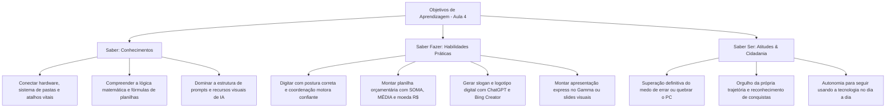

# CURSO EDUCAFRO — INFORMÁTICA BÁSICA & INCLUSÃO DIGITAL
## AULA 4: SÍNTESE, AUTONOMIA E O GRANDE DESAFIO FINAL INTEGRADO
### Guia Completo do Instrutor e Plano de Aula Presencial (09h00 às 17h00)

---

> 🌟 **Nossa Mensagem Central do Dia:**  
> *"Nenhum conhecimento nos é doado; ele é construído com coragem, paciência e companheirismo. Hoje você não apenas demonstra o que aprendeu, mas celebra a certeza de que o mundo digital também pertence a você!"*

---

## 📌 TABELA DE LINKS RÁPIDOS PARA AULA 4

Para facilitar o acesso rápido dos alunos nas atividades práticas do dia, mantenha esta tabela visível ou projete-a no telão:

| Ferramenta / Plataforma | Link Direto de Acesso | Para que serve na aula de hoje | Requisito de Acesso |
| :--- | :--- | :--- | :--- |
| **AgileFingers** | [agilefingers.com/pt](https://agilefingers.com/pt) | Ginástica dos dedos e prática de digitação | Gratuito (Sem cadastro) |
| **ZType (Jogo de Digitação)** | [zty.pe](https://zty.pe) | Treino lúdico e descontraído de digitação rápida | Gratuito (Direto no navegador) |
| **EtherCalc** | [ethercalc.net](https://ethercalc.net) | Planilha instantânea sem necessidade de conta | Gratuito (Sem login) |
| **CryptPad** | [cryptpad.fr](https://cryptpad.fr) | Textos, apresentações e planilhas colaborativas | Gratuito (Navegador) |
| **ChatGPT** | [chatgpt.com](https://chatgpt.com) | Ideação do projeto, redação e slogan | Gratuito (PC ou Celular) |
| **Google Gemini** | [gemini.google.com](https://gemini.google.com) | Pesquisa e refinamento de textos do projeto | Gratuito (Conta Google) |
| **Bing Image Creator** | [bing.com/create](https://www.bing.com/create) | Criação da logo ou ilustração visual do projeto | Gratuito (Conta Microsoft) |
| **Gamma App** | [gamma.app](https://gamma.app) | Apresentação em slides com 1 clique | Gratuito (Conta Google) |

---

## 1. RESUMO EXECUTIVO DO PLANO DE AULA

| Parâmetro | Especificação Pedagógica |
| :--- | :--- |
| **Instituição / Projeto** | EDUCAFRO — Inclusão Digital, Cidadania e Tecnologia Popular |
| **Módulo** | Aula 4: Conclusão, Revisão Geral e Grande Desafio Integrador |
| **Carga Horária** | 8 horas presenciais (Turno Manhã: 09h00–12h30 \| Turno Tarde: 13h30–17h00) |
| **Público-Alvo** | Turma intergeracional: Jovens, Adultos, Idosos, Pessoas com TEA (Transtorno do Espectro Autista) e diferentes ritmos de aprendizagem |
| **Proporção Prática/Teoria** | **80% Prática Ativa e Produção Pessoal** vs. **20% Diálogo, Revisão e Celebração** |
| **Metodologia Central** | Andragogia (Malcolm Knowles) + Aprendizagem Baseada em Projetos (PBL) + Desenho Universal para a Aprendizagem (DUA) + Pedagogia Paulo Freire |
| **Grande Entregável** | **"Projeto Meu Futuro Digital"**: Um mini-projeto completo contendo Pasta organizada (Aula 1), Planilha de Orçamento com fórmulas (Aula 2), Texto/Slogan e Arte Visual com IA (Aula 3) e Apresentação em Slides/Panfleto |
| **Momento Culminante** | Feira de Conquistas (Apresentação de 2 min) + Entrega dos Certificados Oficiais EDUCAFRO |
| **Custo de Ferramentas** | **R$ 0,00** (100% ferramentas gratuitas e acessíveis via navegador) |

---

## 2. OBJETIVOS DE APRENDIZAGEM (MATRIZ CHA)



### 2.1. Conhecimentos (Saber)
- **Integração de Saberes:** Compreender como pastas, planilhas, inteligência artificial e apresentações se conectam para resolver problemas reais da vida, da família e do trabalho.
- **Estrutura e Lógica das Fórmulas:** Recordar o papel do sinal de igual (`=`) e as operações de `=SOMA`, `=MÉDIA` e `=MÁXIMO`.
- **Pensamento Crítico com IA:** Utilizar o assistente como apoio à criatividade humana, exercendo o papel de autor e validador final do conteúdo.

### 2.2. Habilidades (Saber Fazer)
- **Agilidade no Teclado e Mouse:** Posicionar as mãos corretamente, utilizar `Shift`, `Backspace`, `Enter`, acentuações e os atalhos de produtividade (`Ctrl+C`, `Ctrl+V`, `Ctrl+Z`, `Ctrl+A`).
- **Gestão de Arquivos:** Criar pastas na Área de Trabalho com nomes padronizados, salvar arquivos com segurança e manter tudo organizado.
- **Construção de Orçamento:** Montar uma planilha funcional de custos com 4 a 6 linhas, aplicando cálculos automáticos e formatação de valores.
- **Produção Visual e Textual:** Gerar textos persuasivos com ChatGPT/Gemini e criar ilustrações/logos no Bing Image Creator para compor uma apresentação ou cartilha.

### 2.3. Atitudes (Saber Ser e Cidadania)
- **Autonomia e Autoconfiança:** Perder qualquer receio residual de tocar na máquina, sentindo-se capaz e legítimo no universo tecnológico.
- **Solidariedade Comunitária:** Apoiar o colega de bancada durante as etapas do desafio final, celebrando as vitórias coletivas.
- **Empoderamento Social:** Enxergar a tecnologia como uma ponte para geração de renda, estudo contínuo e emancipação pessoal.

---

## 3. CRONOGRAMA GERAL DO DIA (09h00 às 17h00)

| Horário | Módulo / Etapa | Metodologia | Duração | Foco Pedagógico & Vivência |
| :--- | :--- | :--- | :---: | :--- |
| **09:00 - 10:00** | **Módulo 1: Aquecimento & Ginástica dos Dedos** | Prática Individualizada & Lúdica | 60 min | Treino guiado de digitação no AgileFingers e ZType. Postura ergonômica, acolhimento individualizado e ganho de destreza motora. |
| **10:00 - 11:00** | **Módulo 2: Roda da Memória & Grande Revisão das Aulas 1, 2 e 3** | Revisão Dialogada + Quiz Interativo | 60 min | Síntese dinâmica de todo o curso: Hardware, Mouse, Pastas, Atalhos mágicos, Planilhas (Fórmulas `=`), Prompts de IA e Segurança. |
| **11:00 - 11:20** | ☕ **Café da Manhã & Pausa Afetiva** | Convivência | 20 min | Lanche coletivo, café passado, hidratação e troca de ideias entre os colegas. |
| **11:20 - 12:30** | **Módulo 3: O Grande Desafio Final — Parte 1 (Estrutura, Ideia & Planilha)** | Mão na Massa (PBL) | 70 min | Escolha do tema (Meu Negócio ou Projeto Social), criação da Pasta oficial, ideação com ChatGPT/Gemini e elaboração da Planilha de Custos. |
| **12:30 - 13:30** | 🍽️ **Almoço & Descanso Restaurador** | Intervalo Livre | 60 min | Alimentação, caminhada leve, descompressão visual e fortalecimento de vínculos. |
| **13:30 - 15:00** | **Módulo 4: O Grande Desafio Final — Parte 2 (Arte Visual, Slides & Finalização)** | Produção & Refinamento | 90 min | Geração de logo/imagem no Bing Creator, montagem de apresentação no Gamma ou slides visuais, salvamento em PDF e organização de arquivos. |
| **15:00 - 16:15** | **Módulo 5: Feira de Conquistas — Mostra de Autonomia** | Apresentação Oral & Celebração | 75 min | Cada aluno ou dupla compartilha na tela seu projeto por 2 minutos. Aplausos, valorização de cada trajetória e trocas de elogios. |
| **16:15 - 17:00** | **Módulo 6: Formatura, Certificados & Mensagem EDUCAFRO** | Cerimônia Solene | 45 min | Roda de depoimentos, entrega solene dos Certificados de Conclusão, foto oficial da turma e celebração coletiva. |

---

## 4. DETALHAMENTO PASSO A PASSO DAS ATIVIDADES

---

### MÓDULO 1: Aquecimento & Ginástica dos Dedos (09h00 às 10h00)
* **Duração:** 60 minutos
* **Objetivo:** Desenvolver coordenação motora fina no teclado, velocidade, memorização da posição das teclas e confiança ergonômica, enquanto a turma se acomoda e entra em estado de concentração de forma suave e sem estresse.
* **Ferramentas:** [AgileFingers](https://agilefingers.com/pt) e jogo [ZType](https://zty.pe).

#### Instruções para o Professor:
1. **Acolhimento na Porta:** Receba os alunos com música ambiente suave (instrumental ou MPB clássica em volume baixo). Cumprimente cada um pelo nome.
2. **Postura e Ergonomia (5 min):** 
   - Mostre como sentar com as costas apoiadas na cadeira e os pés apoiados no chão.
   - Relembre o relevo das teclas **F** e **J**: *"Os dedos indicadores descansam aqui! É a casa dos seus dedos"*.
3. **Fase 1 — Exercício Guiado no AgileFingers (25 min):**
   - Peça para os alunos acessarem `agilefingers.com/pt`.
   - Escolha o exercício da **Linha Central (A S D F - J K L Ç)**.
   - Oriente: *"Não olhe para o teclado a cada letra; confie na memória dos seus dedos. Não temos pressa, o segredo é o ritmo!"*.
4. **Fase 2 — Digitação com Sentido e Cidadania (15 min):**
   - Abra o editor de texto ou Bloco de Notas e projete três frases inspiradoras para os alunos digitarem, praticando maiúsculas com `Shift` e pontuação:
     - *Frase 1:* `"A educação liberta a mente e transforma a nossa história."`
     - *Frase 2:* `"Eu sou capaz de aprender qualquer tecnologia com calma e treino."`
     - *Frase 3:* `"A tecnologia é um direito de todos e todas."`
5. **Fase 3 — Jogo Descontraído ZType (15 min):**
   - Acesse `zty.pe` no navegador.
   - Explique a mecânica lúdica: uma "navezinha" que destrói meteoros conforme você digita as letrinhas das palavras que caem na tela. É diversão pura para perder a rigidez nas mãos!

> 💡 **Nota Pedagógica de Bastidores para o Instrutor:**  
> Este bloco de 60 minutos foi desenhado para acolher com gentileza a turma. Alunos que chegam logo no início aproveitam uma rica sessão de treino motor individualizado; alunos que chegam ao longo da hora entram suavemente na prática sem interromper o fluxo da sala e sem perder explicações teóricas.

---

### MÓDULO 2: Roda da Memória Viva — A Grande Revisão das 3 Aulas (10h00 às 11h00)
* **Duração:** 60 minutos
* **Objetivo:** Relembrar e conectar organicamente os principais conceitos aprendidos nas Aulas 1, 2 e 3, preparando a mente para o Desafio Final.
* **Metodologia:** Roda de perguntas participativa em formato de "Quiz do Milhão da Cidadania Digital" (dinâmico, alegre e sem julgamentos).

#### Estrutura da Revisão por Blocos (20 min cada):

#### 🔹 Bloco 1: Aula 1 — O Computador sem Medo & Primeiros Passos
- **Perguntas Disparadoras na Lousa:**
  - *"Qual a diferença entre o Gabinete e o Monitor?"* (O gabinete pensa e guarda; o monitor mostra).
  - *"Para que serve o botão esquerdo e o botão direito do mouse?"* (Esquerdo = ação/clique; Direito = menu de opções).
  - *"O que faz o atalho mágico `Ctrl` + `Z`?"* (Desfaz qualquer erro, é a borracha do computador!).
  - *"Para que servem as pastas amarelas?"* (Para guardar e organizar a bagunça dos arquivos).
- **Mini-Prática Relâmpago:** Na Área de Trabalho, clique com botão direito $\rightarrow$ crie uma pasta chamada `Treino` $\rightarrow$ aperte `F2` para renomear $\rightarrow$ aperte `Delete` para apagar.

#### 🔹 Bloco 2: Aula 2 — Produtividade, Planilhas & Apresentações
- **Perguntas Disparadoras na Lousa:**
  - *"Qual é a Regra de Ouro número 1 de qualquer fórmula na planilha?"* (Começar sempre com o sinal de `=`).
  - *"Qual fórmula usamos para somar uma lista inteira de números?"* (`=SOMA(B2:B6)`).
  - *"E para saber qual a conta mais cara e a média dos gastos?"* (`=MÁXIMO()` e `=MÉDIA()`).
  - *"O que faz um bom slide de apresentação?"* (Pouco texto, letras bem grandes e imagens marcantes!).
- **Mini-Prática Relâmpago:** No Excel ou EtherCalc, digite 3 valores (10, 20, 30) e faça a fórmula `=SOMA(A1:A3)` para ver o número 60 aparecer magicamente.

#### 🔹 Bloco 3: Aula 3 — Inteligência Artificial no Cotidiano
- **Perguntas Disparadoras na Lousa:**
  - *"A Inteligência Artificial é um mágico que sabe tudo ou um assistente que precisa de ordens bem explicadas?"*
  - *"Quais são os 4 segredos para montar um pedido perfeito (prompt)?"*
    1. Quem ela deve ser (Papel/Profissão).
    2. O que ela deve fazer (Tarefa detalhada).
    3. Para quem é (Público-alvo).
    4. Como deve ser a resposta (Formato, tamanho e tom).
  - *"O que é a 'alucinação' da IA?"* (Quando o robô inventa informações falsas com cara de verdade; nós somos o revisor final!).
  - *"Quais dados NUNCA colocamos em ferramentas de IA?"* (Senhas, dados bancários e documentos pessoais!).

---

### ☕ PAUSA PARA O CAFÉ & INTEGRAÇÃO (11h00 às 11h20)
* 20 minutos de pausa afetiva com café, bolachas/frutas e bate-papo descontraído.
* Momento de levantar da cadeira, alongar os punhos e conversar sobre as ideias que serão aplicadas no Desafio Final.

---

### MÓDULO 3: O Grande Desafio Final — Parte 1: Estruturação, Ideia & Orçamento (11h20 às 12h30)
* **Duração:** 70 minutos
* **Objetivo:** Iniciar o projeto integrador aplicando organização de pastas no sistema, formulação de texto/conceito com Inteligência Artificial e criação de planilha financeira.
* **Metodologia:** Projeto individual ou em duplas solidárias.

#### Tema do Desafio: *"Meu Futuro Digital — Negócio Popular ou Ação Comunitária"*
Cada aluno(a) escolhe uma ideia real ou de seus sonhos. Exemplos:
1. *Culinária:* Venda de Marmitas Fit, Bolos Caseiros da Vovó, Pastelaria do Bairro.
2. *Serviços:* Oficina de Costura e Reformas, Eletricista e Reparos Rápidos, Cuidador(a) de Idosos.
3. *Comunitário / Social:* Projeto de Reforço Escolar na Favela, Horta Comunitária, Sarau Cultural Afro.
4. *Pessoal:* Planejamento da Festa de 15 Anos da Neta, Orçamento da Reforma da Casa.

#### Passo a Passo da Parte 1 (Guiado pelo Professor):

```
PASSO 1: Organizar a Casa no Computador (Aula 1)
  └─ Vá na Área de Trabalho
  └─ Clique com o botão direito -> Novo -> Pasta
  └─ Nome da pasta: PROJETO_FINAL_[SEU_NOME]

PASSO 2: Ideação e Texto com a IA (Aula 3)
  └─ Abra o ChatGPT (chatgpt.com) ou Gemini (gemini.google.com)
  └─ Use a técnica do Prompt Completo:
     "Aja como especialista em pequenos negócios populares.
      Eu quero criar um projeto de [nome da ideia].
      Me ajude com:
      1) Um nome marcante para o negócio;
      2) Um slogan curto de até 8 palavras;
      3) 3 principais serviços ou produtos oferecidos;
      4) Um pequeno texto de apresentação de 1 parágrafo para divulgar no WhatsApp."
  └─ Copie os melhores resultados (Ctrl+C e Ctrl+V) e salve em um documento de texto dentro da sua pasta!

PASSO 3: Planilha Orçamentária no Excel ou EtherCalc (Aula 2)
  └─ Abra o Excel ou EtherCalc
  └─ Monte uma tabela simples com 5 itens necessários para o projeto:
     - Coluna A: Item / Despesa
     - Coluna B: Quantidade
     - Coluna C: Valor Unitário (R$)
     - Coluna D: Total (Quantidade * Valor) ou digite o Custo Estimado
  └─ Aplique as fórmulas aprendidas:
     - Linha de TOTAL GERAL: =SOMA(D2:D6)
     - Linha de CUSTO MÉDIO: =MÉDIA(D2:D6)
     - Linha de ITEM MAIS CARO: =MÁXIMO(D2:D6)
  └─ Salve a planilha com o nome Orcamento_Meu_Projeto na sua pasta!
```

---

### 🍽️ ALMOÇO COLETIVO & DESCANSO RESTAURADOR (12h30 às 13h30)
* 60 minutos de pausa para refeição compartilhada, descanso dos olhos e socialização.
* O professor deixa o laboratório preparado e organizado para a segunda etapa.

---

### MÓDULO 4: O Grande Desafio Final — Parte 2: Identidade Visual, Slides & Finalização (13h30 às 15h00)
* **Duração:** 90 minutos
* **Objetivo:** Concluir o projeto integrador criando a identidade visual com IA, montando a apresentação em slides e organizando todos os arquivos para a entrega final.

#### Passo a Passo da Parte 2:

```
PASSO 4: Criando a Imagem/Logo no Bing Image Creator (Aula 3)
  └─ Abra o navegador em: bing.com/create
  └─ Escreva um pedido detalhado de arte visual:
     "Logotipo profissional para um negócio chamado [Nome do Projeto],
      que trabalha com [área de atuação], estilo vetor moderno,
      cores vibrantes, fundo limpo, visual acolhedor e elegante."
  └─ Escolha a imagem que mais gostou, clique nela, clique com botão direito -> 'Salvar imagem como...'
  └─ Salve a imagem dentro da sua pasta PROJETO_FINAL_[SEU_NOME]!

PASSO 5: Criando os Slides no Gamma App ou PowerPoint (Aulas 2 e 3)
  └─ OPÇÃO A (Super Rápida no Gamma App - gamma.app):
     - Clique em 'Criar Novo' -> 'Gerar' -> 'Apresentação (3 a 5 slides)'
     - Digite o tema e cole as ideias geradas pelo ChatGPT no Módulo 3.
     - A ferramenta gera a apresentação pronta e bonita em menos de 1 minuto!
     - Troque uma das imagens pela foto/logo gerada no Bing Creator.
  └─ OPÇÃO B (Manual no PowerPoint ou Google Apresentações):
     - Slide 1: Capa (Nome do Projeto, Slogan e Nome do Aluno).
     - Slide 2: O que fazemos (Os 3 produtos/serviços e a imagem do Bing).
     - Slide 3: Nossos Custos e Contato (Copie o valor total da planilha e adicione um telefone).

PASSO 6: O Checklist de Salvamento e Organização (Aula 1)
  └─ Abra a sua pasta PROJETO_FINAL_[SEU_NOME]
  └─ Verifique se contém:
     [X] Documento de Texto com Slogan e Apresentação
     [X] Planilha Orçamentária com as Fórmulas de SOMA e MÉDIA
     [X] Imagem / Logo criada com IA
     [X] Apresentação pronta em Slides ou PDF
  └─ Parabéns! Seu projeto está 100% concluído!
```

---

### MÓDULO 5: Feira de Conquistas — Mostra de Autonomia (15h00 às 16h15)
* **Duração:** 75 minutos
* **Objetivo:** Praticar a expressão oral, valorizar a autoria de cada estudante, promover a escuta atenta e comemorar os avanços de cada participante perante o coletivo.
* **Formato:** Apresentações curtas ("Pitch Comunitário") de 2 a 3 minutos por projeto.

#### Roteiro Simples para o Aluno Falar (Projetado na Lousa):
1. *"Meu nome é..."*
2. *"Meu projeto se chama..."*
3. *"Ele serve para..."*
4. *"A ferramenta que eu mais gostei de usar para criar foi..."*
5. *"O que eu sinto hoje ao ver meu projeto pronto é..."*

#### Postura do Instrutor e da Turma:
- Cada apresentação é celebrada com uma salva de palmas calorosa.
- O professor faz 1 comentário elogioso destacando um ponto forte do trabalho (a organização da planilha, a criatividade do prompt, a beleza das cores, o capricho da pasta).
- Estimula-se que os colegas façam comentários de incentivo.

---

### MÓDULO 6: Cerimônia de Formatura, Certificados & Mensagem EDUCAFRO (16h15 às 17h00)
* **Duração:** 45 minutos
* **Objetivo:** Consagrar o encerramento do curso com dignidade, emoção, pertencimento comunitário e reconhecimento oficial da vitória de cada participante.

#### Roteiro da Cerimônia:
1. **Palavra de Abertura do Instrutor (5 min):**
   - Resgate da memória da Aula 1: *"Lembram do medo do mouse? Do medo de clicar e quebrar o computador? Olhem onde vocês chegaram hoje: mexendo em planilhas, gerando imagens com inteligência artificial, criando apresentações completas e organizando seus próprios arquivos com autonomia total!"*
2. **Depoimento Aberto da Turma (10 min):**
   - Microfone aberto para 3 ou 4 alunos que queiram compartilhar o que este curso significou em suas vidas.
3. **Chamada Nominal e Entrega dos Certificados (20 min):**
   - Chamar cada formando à frente com música solene e festiva.
   - Aperto de mão / abraço afetuoso, entrega do Certificado de Conclusão de Informática Básica & Inclusão Digital da EDUCAFRO.
   - Aplausos de toda a sala.
4. **Foto Oficial da Turma (5 min):**
   - Todos reunidos à frente com seus certificados erguidos e sorrisos no rosto.
5. **Mensagem Final da EDUCAFRO e Encerramento (5 min):**
   - Leitura coletiva da frase de encerramento e abraço comunitário.

---

## 5. ADAPTAÇÕES METODOLÓGICAS & ACESSIBILIDADE (DUA)

Para garantir que a turma heterogênea participe em condições plenas de dignidade e sucesso:

### 👵👴 Para Pessoas Idosas:
- **Ritmo com Calma:** Sem contagem regressiva ou cobrança por velocidade; o foco é na consolidação do entendimento.
- **Acessibilidade Visual:** Monitores com zoom configurado em 125% ou 150% (`Ctrl` + `+`).
- **Valorização da Sabedoria:** Estimular que o projeto final seja inspirado em seus saberes tradicionais (receitas de família, artesanato, memórias, horta medicinal).

### 🧩 Para Alunos com TEA (Transtorno do Espectro Autista) ou Ansiedade:
- **Previsibilidade Absoluta:** O cronograma da aula permanece anotado na lousa com caixas de seleção que o professor marca conforme cada etapa é concluída.
- **Apresentação Opcional:** O aluno com fobia social severa não é obrigado a falar ao microfone na Feira de Conquistas; ele pode escolher ter seu trabalho exibido na tela pelo professor ou receber o feedback em particular.
- **Ambiente Sensorialmente Confortável:** Sala bem iluminada, sem luzes piscantes e sem volume excessivo durante as atividades práticas.

### ⚡ Para Alunos Mais Ágeis (Desafios Bônus):
- **Missão Monitor Solidário:** Quem concluir suas tarefas antes é convidado a sentar ao lado de um colega com maior dificuldade motora para apoiar com paciência e empatia.
- **Desafio Bônus:** Exportar a planilha para PDF, criar uma fórmula condicional `=SE(Total>500; "ATENÇÃO"; "DENTRO DO ORÇAMENTO")` ou gerar um panfleto extra para impressão.

---

## 6. MATERIAIS & CHECKLIST DO PROFESSOR

### Antes da Aula:
- [ ] Testar a conexão de internet de todas as máquinas do laboratório.
- [ ] Verificar se os navegadores abrem sem bloqueios os sites do plano (AgileFingers, ZType, EtherCalc, ChatGPT, Gemini, Bing Create, Gamma).
- [ ] Ter no pendrive uma cópia dos modelos de projeto (planilha de exemplo e prompts) caso alguém tenha bloqueio criativo.
- [ ] Certificados impressos e preenchidos com os nomes dos alunos.
- [ ] Caixa de som conectada para a música de acolhimento e o momento solene dos certificados.
- [ ] Lanche do café da manhã organizado.

### Durante a Aula:
- [ ] Manter o acolhimento caloroso e o incentivo permanente em cada bancada.
- [ ] Fazer backups das pastas dos alunos em um pendrive ou na nuvem para garantir que ninguém perca seus trabalhos.
- [ ] Registrar fotos das etapas para o portfólio da turma e da EDUCAFRO.

---

## 7. MENSAGEM FINAL DE FORMATURA EDUCAFRO

> *"A tecnologia não é privilégio de poucos: ela é um instrumento sagrado de emancipação popular, dignidade no trabalho e exercício pleno da cidadania.  
> Cada clique que você deu, cada fórmula que acertou e cada medo que venceu provam que o futuro também pertence a você e à sua comunidade.  
> Nunca pare de aprender, ensine o que aprendeu a quem precisa e ocupe todos os espaços com a cabeça erguida!"*  
>  
> **Viva a Educação Popular! Viva a EDUCAFRO! Parabéns pela sua Formatura!** 🎓✨
