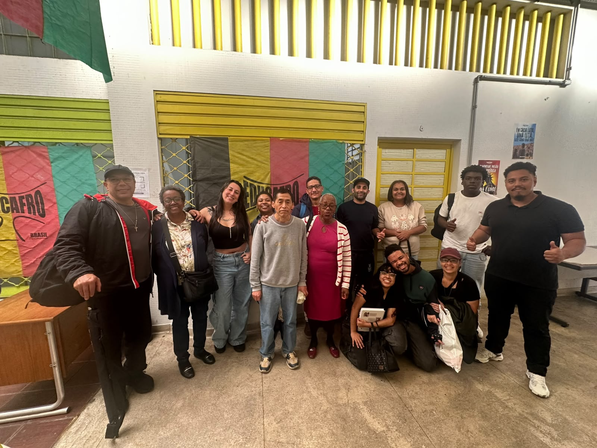
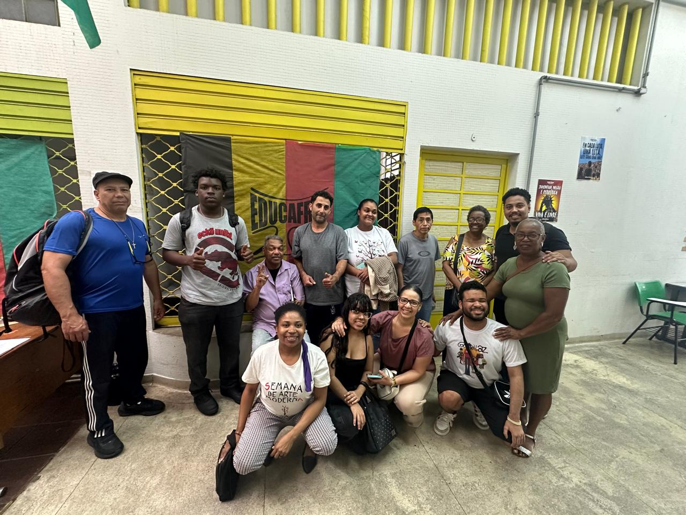

# 🌐 Language / Idioma
**🇺🇸 English (Priority / Default)** &nbsp;•&nbsp; [🇧🇷 Versão em Português](#versao-em-portugues)

---

# 🎓 EDUCAFRO Course – Basic Computing & Digital Inclusion
### 📚 Study Guide, Records, and Class Materials
**Author and Instructor:** [Leanderson Dias de Lima](https://www.linkedin.com/in/leanderson-dias-de-lima/)

---

## 🏁 Course Conclusion & Thank You Note

It is with immense joy, emotion, and a deep sense of accomplishment that I register here: **our EDUCAFRO Basic Computing and Digital Inclusion classes have concluded with complete success!** 🎉

I would like to express my deepest and most sincere gratitude to every student who walked alongside us throughout this journey. Sharing these Saturdays and learning moments, exchanging life experiences, and building this knowledge together was a true honor and privilege for me.

My heartfelt thanks to everyone for your trust, warm encouragement, and for an unforgettable journey! ✊🏿💻✨

---

## 📸 Class Photos & Records

These memories capture our journey, solidarity, and the collective triumph of all our graduates:

*Our wonderful class proudly gathered in front of the EDUCAFRO banner, celebrating learning and resilience.*

*Smiles that symbolize fellowship, persistence, and the achievement of digital autonomy.*

---

## 🧭 Table of Contents
- [📖 About the Project](#en-about)
- [🏁 Course Conclusion & Thank You Note](#en-conclusion)
- [📸 Class Photos & Records](#en-records)
- [💻 How to Use the Repository Materials](#en-materials)
- [🖥️ Class 1: The Computer Without Fear & First Steps](#en-class-1)
- [📊 Class 2: Digital Inclusion, Web Tools & Productivity](#en-class-2)
- [🤖 Class 3: Practical & Everyday Artificial Intelligence](#en-class-3)
- [🚀 Class 4: Synthesis, Autonomy & The Grand Final Challenge](#en-class-4)
- [⌨️ Quick Keyboard Shortcuts Cheat Sheet](#en-shortcuts)
- [🔗 Master Directory of Free Tools and Links](#en-tools)
- [✊🏿 Final EDUCAFRO Message](#en-message)
- [🤝 About the Author & Connect](#en-author)
- [📄 License](#en-license)
- [🇧🇷 Ir para a Versão em Português](#versao-em-portugues)

---

## 📖 About the Project

The **Basic Computing and Digital Inclusion** course was voluntarily developed under the auspices of **EDUCAFRO**, aiming to democratize access to contemporary technologies for an intergenerational audience (youth, adults, seniors, and learners with diverse paces of learning). 

With a humanized, hands-on, and daily-life-centered approach, the workshops covered everything from the physical inner workings of the computer and safe internet navigation to the practical use of spreadsheets and generative Artificial Intelligence assistants, culminating in the showcase of autonomous personal projects.

> 🌟 **Our Golden Rule:**  
> **You will not break the computer!** The computer is not made of glass. You can click, explore, and make mistakes without fear. If you do something accidentally, almost everything can be undone with the magic shortcut `Ctrl` + `Z`!

---

## 💻 How to Use the Repository Materials

You can study this material online directly in your browser or download the files to practice on your computer:

### 1. Direct Online Viewing (GitHub)
- Browse the `.md` files listed in the table of contents to read summaries, shortcut tables, and teaching roadmaps.
- Check out the detailed lesson plans and activities:
  - [AULA_3_INTELIGENCIA_ARTIFICIAL.md](AULA_3_INTELIGENCIA_ARTIFICIAL.md) — Practical Artificial Intelligence Guide.
  - [AULA_4.md](AULA_4.md) — Lesson Plan & Integrated Final Challenge.
  - [PROVA_AULA_2.md](PROVA_AULA_2.md) and [PROVA_AULA_3.md](PROVA_AULA_3.md) — Review quizzes and self-assessments.

### 2. Downloading & Opening Files Locally
To download all files to your computer:
1. Click the green **`Code`** button at the top right of this GitHub repository.
2. Select **`Download ZIP`** and extract the files to your Desktop or preferred folder.
3. To open presentations and spreadsheets:
   - Presentations: `.pptx` or `.pdf` files (compatible with PowerPoint, LibreOffice Impress, or Google Slides).
   - Spreadsheets: [`Aula2-Excel.xlsx`](Aula2-Excel.xlsx) (compatible with Microsoft Excel, Calc, Google Sheets, or CryptPad Sheet).

---

## 🖥️ Class 1: The Computer Without Fear & First Steps

### 1. The Parts of the Computer
| Component | What it does | It's like... |
| :--- | :--- | :--- |
| **Monitor (Screen)** | Displays everything that is happening | A television |
| **Computer Case (Tower)** | Thinks, processes, and stores your data | The brain and the filing cabinet |
| **Keyboard** | Types letters, numbers, and commands | A modern typewriter |
| **Mouse** | Points, selects, and clicks on screen items | Your index finger |

* **How to Turn On:** Press the power button on the **Computer Case / Tower**, then press the power button on the **Monitor**. Wait about a minute for the desktop to load!

---

### 2. Mastering the Mouse
- **Left Button (Index finger):** The action and "yes" button. Used to select, click links, and press buttons.
- **Right Button (Middle finger):** Opens an **options menu** with helpful tools (like copy, paste, rename, and delete).
- **Middle Scroll Wheel:** Scrolls the page up and down, just like flipping pages in a magazine.
- **Double-Click:** Two rapid clicks with the left button to **open folders and programs** on the Desktop.
- **Click & Drag (Drag and Drop):** Click an item, hold the button down, move the mouse, and release it wherever you want.

---

### 3. Essential Keyboard Keys
- `ENTER`: Confirms an action, submits requests, or moves to the next line down.
- `BACKSPACE` ($\leftarrow$): Erases the last typed character to the left of the cursor.
- `SPACEBAR`: Inserts a blank space between words.
- `SHIFT`: Hold down to type a **CAPITAL** letter or access upper symbols (such as `?`, `!`, `@`).
- `CAPS LOCK`: Locks all letters in uppercase permanently until pressed again.
- **F and J Keys:** Feature small tactile bumps so you can position your index fingers without needing to look down at the keyboard.

---

### 4. Files, Folders, and Documents
- **Folders (Yellow icons):** Used to organize your files (just like file folders at home or in an office).
- **Creating a Folder:** Right-click on empty space $\rightarrow$ choose **New** $\rightarrow$ **Folder** $\rightarrow$ type the name and press `ENTER`.
- **Word Processor / Text Editor:** Used to write letters, recipes, notices, and resumes. You can change text colors, increase font size, and apply **Bold**.
- **Saving a Document:** Always click the floppy disk icon or navigate to **File $\rightarrow$ Save** so you don't lose your work.

---

### 5. Web Browsing and Email
- **Web Browser (Google Chrome, Edge, Firefox):** The window that opens the internet on your computer.
- **Address Bar:** Located at the very top of the browser and acts like a GPS:
  - *If you know the exact address:* Type it all together (e.g., `google.com`) and press `ENTER`.
  - *If you don't know the address:* Type what you're looking for (e.g., *easy carrot cake recipe*) and choose from the results.
- **Email:** Your virtual mailbox to send messages, receive receipts/confirmations, and safely register accounts across the web.

---

## 📊 Class 2: Digital Inclusion, Web Tools & Productivity

### 1. Electronic Spreadsheets (Excel, EtherCalc, and CryptPad Sheet)
A spreadsheet is like a smart grid notebook that does calculations automatically.
- **Columns:** Vertical letters (**A**, **B**, **C**...).
- **Rows:** Horizontal numbers (**1**, **2**, **3**...).
- **Cell:** The intersection of a column and a row (example: column **B** and row **2** form cell `B2`).

---

### 2. The Golden Rule of Spreadsheet Formulas
> ⚠️ **Every formula in a spreadsheet MUST begin with an equals sign (`=`).**  
> If you forget the `=`, the spreadsheet treats your entry as plain text and will not calculate the result!

#### Key Practical Formulas:
- **Sum Values:** `=SUM(B2:B6)` *(in Portuguese: `=SOMA(B2:B6)`)* — Adds up all numbers from B2 to B6.
- **Average Expenses:** `=AVERAGE(B2:B6)` *(in Portuguese: `=MÉDIA(B2:B6)`)* — Calculates the average value of the list.
- **Highest Value (Most expensive bill):** `=MAX(B2:B6)` *(in Portuguese: `=MÁXIMO(B2:B6)`)* — Shows the highest number.
- **Lowest Value (Cheapest bill):** `=MIN(B2:B6)` *(in Portuguese: `=MÍNIMO(B2:B6)`)* — Shows the lowest number.
- **Count Entries:** `=COUNT(B2:B6)` *(in Portuguese: `=CONT.NÚM(B2:B6)`)* — Counts how many numbers exist in the list.
- **Logical Decision with IF:** `=IF(B2>100, "HIGH COST", "ON TARGET")` *(in Portuguese: `=SE(B2>100; "CUSTO ALTO"; "DENTRO DA META")`)* — Evaluates whether the cost exceeded a set limit.

---

### 3. Hassle-Free Slide Presentations
- **Golden Rule:** *You are the star! The slide is merely visual support.*
- **What to do:** Large text, short sentences, few lines, and clean, beautiful images.
- **What to avoid:** Long paragraphs, tiny fonts, and cluttering multiple topics onto a single slide.
- **Basic 3-Slide Structure:**
  1. **Cover / Title:** Topic title and your name.
  2. **Content:** 3 main bullet points explained in concise phrases.
  3. **Conclusion:** The key takeaway you want your audience to remember.

---

## 🤖 Class 3: Practical & Everyday Artificial Intelligence

### 1. What is Artificial Intelligence (AI)?
Artificial Intelligence (such as **ChatGPT** and **Google Gemini**) functions like an eager, free assistant that has read millions of books and web examples, responding to questions in natural, human language—just like chatting on WhatsApp.

* **Voice Typing:** If your hands get tired or you prefer speaking, simply click the **microphone icon** and dictate your question with your own voice.

---

### 2. The Art of Crafting Great Prompts
The clearer and more detailed your request, the better the robot's answer!

#### The 4 Secrets to a Perfect Prompt:
1. 🎭 **Who the AI should be (Persona):** Define its role/profession *(e.g., "Act as an award-winning, patient chef")*.
2. 🎯 **What it should do (Task):** State the exact task *(e.g., "Create a carrot cake recipe with a crispy chocolate glaze")*.
3. 👥 **Who it is for (Audience):** Specify the target user *(e.g., "For a complete beginner in the kitchen")*.
4. 📏 **How the answer should look (Format):** Ask for specific details *(e.g., "Include measurements in cups, baking time, and 3 golden tips")*.

---

### 3. Practical AI Tools Used

| Tool | Purpose | What you can do with it |
| :--- | :--- | :--- |
| **ChatGPT & Gemini** | Conversational assistants | Ask questions, generate recipes, draft letters, plan shopping lists, and organize finances. |
| **Bing Image Creator** | Digital art studio | Create illustrations, drawings, logos, and posters from descriptive text prompts. |
| **Character.AI** | Character dialogues | Chat with historical figures and renowned writers (such as Machado de Assis and Carolina Maria de Jesus). |
| **Gamma App** | Presentations in 1 minute | Generate complete slide decks and documents with professional design from a single prompt. |
| **Google NotebookLM** | Smart study notebook | Upload PDF books and materials (from WeLib) to synthesize and answer questions grounded strictly in real sources. |

---

### 4. Essential Precautions and Digital Safety
- 🔒 **Privacy:** **NEVER** enter bank passwords, credit card numbers, or sensitive government IDs (such as SSN/CPF) into public AI assistants.
- 🧠 **Critical Thinking (Hallucinations):** AI can sometimes become confused and invent inaccurate or false details. The human being is **always the final reviewer and validator** of everything generated by the machine.

---

## 🚀 Class 4: Synthesis, Autonomy & The Grand Final Challenge

The closing class brought together all knowledge acquired throughout the course into an **Integrated Hands-On Project**, consolidating digital autonomy and celebrating the cohort's achievement:

- **Warm-up & Finger Exercises:** Typing drills on [AgileFingers](https://agilefingers.com/) and the game [ZType](https://zty.pe).
- **Living Memory Circle:** An interactive group review of Hardware, Mouse techniques, Shortcuts, Spreadsheets (`=SUM`, `=AVERAGE`, `=MAX`), AI Prompts, and Safety.
- **The Final Challenge ("My Digital Future"):**
  1. *Folder Organization:* Standardized folder creation and file naming on the computer (Class 1).
  2. *AI Ideation:* Generating slogans, project names, and promotional texts with ChatGPT and Gemini (Class 3).
  3. *Spreadsheet Budgeting:* Building an expense breakdown with automatic formulas for `=SUM` and `=AVERAGE` (Class 2).
  4. *Visual Identity & Slides:* Generating logos/artwork via Bing Image Creator and express presentation decks in Gamma App (Classes 2 & 3).
- **Autonomy Showcase & Graduation:** Community showcase of each student's project and formal conferral of EDUCAFRO Certificates.

> 📄 **Complete Lesson Plan:** Check out the detailed documentation in [AULA_4.md](AULA_4.md).

---

## ⌨️ Quick Keyboard Shortcuts Cheat Sheet

Keep these commands handy to streamline your daily computer use:

| Shortcut | What it does |
| :--- | :--- |
| `Ctrl` + `Z` | **Undo:** Fixes mistakes instantly and reverts the screen to how it was before. |
| `Ctrl` + `C` | **Copy:** Copies selected text or images to the clipboard. |
| `Ctrl` + `V` | **Paste:** Pastes whatever you just copied right where the cursor is located. |
| `Ctrl` + `X` | **Cut:** Removes selected text or files from one place so you can paste them elsewhere. |
| `Ctrl` + `A` | **Select All:** Highlights all text or selects all files at once. |
| `Ctrl` + `+` | **Zoom In:** Enlarges web page content and text for easier reading. |
| `Ctrl` + `-` | **Zoom Out:** Reduces the page magnification. |
| `Ctrl` + `0` | **Reset Zoom:** Restores default magnification to normal (100%). |
| `Ctrl` + `P` | **Print:** Opens the print dialog for documents and web pages. |

---

## 🔗 Master Directory of Free Tools and Links

All platforms used throughout the course are **100% free** and run directly in your web browser (on both computers and mobile devices):

| Category | Tool Name | Access Link | What to practice |
| :--- | :--- | :--- | :--- |
| 🖱️ **Mouse Training** | **GCF Global - Mouse Tutorial** | [edu.gcfglobal.org](https://edu.gcfglobal.org/en/mousetutorial/) | Guided clicking, double-clicking, and drag-and-drop exercises. |
| 🎯 **Mouse Precision** | **Mouse Accuracy** | [mouseaccuracy.com](https://mouseaccuracy.com) | Click accuracy game to build hand stability and reflexes. |
| ⌨️ **Typing Skills** | **AgileFingers** | [agilefingers.com](https://agilefingers.com) | Proper finger placement and home-row typing practice. |
| 🎮 **Typing Game** | **ZType** | [zty.pe](https://zty.pe) | Engaging space shooter game to build typing speed and rhythm. |
| 📊 **Quick Spreadsheets** | **EtherCalc** | [ethercalc.net](https://ethercalc.net) | Practice math and spreadsheet formulas without needing an account. |
| 📝 **Cloud Office Suite** | **CryptPad** | [cryptpad.fr](https://cryptpad.fr) | Create collaborative, private docs, spreadsheets, and slides. |
| 🤖 **AI Assistant** | **ChatGPT** | [chatgpt.com](https://chatgpt.com) | Daily conversation, budget drafting, and step-by-step recipes. |
| 🔍 **AI Research** | **Google Gemini** | [gemini.google.com](https://gemini.google.com) | Up-to-date queries, planning, and Google Workspace integration. |
| 🎨 **Art & Images** | **Bing Image Creator** | [bing.com/create](https://www.bing.com/create) | Design artwork, illustrations, and logos using text descriptions. |
| 🎭 **Historical Personas**| **Character.AI** | [character.ai](https://character.ai/) | Educational roleplay and dialogue with historic figures. |
| 📊 **Slide Decks** | **Gamma App** | [gamma.app](https://gamma.app) | Generate polished presentations in under 60 seconds. |
| 📚 **Free Books** | **WeLib (Free Library)** | [pt.welib.org](https://pt.welib.org/) | Download free public domain and educational PDF books. |
| 📖 **Grounded Study** | **Google NotebookLM** | [notebook.google](https://notebook.google/) | Intelligent study notebook strictly grounded in your PDF sources. |

---

## ✊🏿 Final EDUCAFRO Message

> *"Technology does not belong solely to those with technical degrees or expensive equipment: it is an instrument of citizenship, emancipation, work, and community empowerment."*  
>  
> Congratulations on your dedication, courage, and perseverance across all classes. **Keep practicing every single day**, share what you learned with your loved ones, and never stop taking up the spaces you deserve!

---

## 🤝 About the Author & Connect

This curriculum and repository were conceived, structured, and taught by me, **[Leanderson Dias de Lima](https://www.linkedin.com/in/leanderson-dias-de-lima/)**, for the **EDUCAFRO Basic Computing and Digital Inclusion** workshops.

If this material has been useful to you, your community, school, or social initiative:
- 🌐 **LinkedIn:** [linkedin.com/in/leanderson-dias-de-lima](https://www.linkedin.com/in/leanderson-dias-de-lima/)
- 💬 **Let's connect!** Feel free to reach out to ask questions, share insights on digital inclusion and popular education, suggest improvements, or partner on new initiatives. Every connection advancing the democratization of technology is deeply welcomed!

---

## 📄 License

This project is licensed under the **MIT License** — see the [LICENSE](LICENSE) file for details.

---
---

# 🌐 Idioma / Language
[🇺🇸 Switch to English (Priority)](#english-version) &nbsp;•&nbsp; **🇧🇷 Versão em Português**

---

# 🎓 Curso EDUCAFRO – Informática Básica e Inclusão Digital
### 📚 Guia de Estudos, Registros e Materiais das Aulas
**Autor e Instrutor:** [Leanderson Dias de Lima](https://www.linkedin.com/in/leanderson-dias-de-lima/)

---

## 🏁 Conclusão do Curso & Mensagem de Agradecimento

É com enorme alegria, emoção e sensação de dever cumprido que registro aqui: **as nossas aulas do Curso de Informática Básica e Inclusão Digital da EDUCAFRO foram concluídas com pleno sucesso!** 🎉

Gostaria de deixar registrado o meu mais profundo e sincero agradecimento a cada aluna e a cada aluno que esteve conosco durante toda essa caminhada. Compartilhar esses sábados e momentos de aprendizado, trocar experiências de vida e construir juntos esse conhecimento foi uma verdadeira honra e um privilégio para mim.

Meu muito obrigado a todas e todos pela confiança, pelo carinho e pela jornada inesquecível! ✊🏿💻✨

---

## 📸 Registros da Nossa Turma

Estes registros eternizam a nossa trajetória, a união e a vitória coletiva de todos os formandos:

*Nossa querida turma reunida com orgulho em frente à bandeira da EDUCAFRO, celebrando o aprendizado e a superação.*

*Sorrisos que simbolizam o companheirismo, a persistência e a conquista da autonomia digital.*

---

## 🧭 Sumário de Navegação
- [📖 Sobre o Projeto](#pt-sobre)
- [🏁 Conclusão do Curso & Agradecimento](#pt-conclusao)
- [📸 Registros da Nossa Turma](#pt-registros)
- [💻 Como Utilizar os Materiais deste Repositório](#pt-como-utilizar)
- [🖥️ Aula 1: O Computador sem Medo & Primeiros Passos](#pt-aula-1)
- [📊 Aula 2: Inclusão Digital, Ferramentas Web e Produtividade](#pt-aula-2)
- [🤖 Aula 3: Inteligência Artificial Prática e Cotidiana](#pt-aula-3)
- [🚀 Aula 4: Síntese, Autonomia e o Grande Desafio Final](#pt-aula-4)
- [⌨️ Cola Rápida de Atalhos do Teclado](#pt-atalhos)
- [🔗 Tabela Geral de Links e Ferramentas Gratuitas](#pt-links)
- [✊🏿 Mensagem Final da EDUCAFRO](#pt-mensagem)
- [🤝 Sobre o Autor & Conecte-se](#pt-sobre-o-autor)
- [📄 Licença](#pt-licenca)
- [🇺🇸 Go to English Version](#english-version)

---

## 📖 Sobre o Projeto

O curso de **Informática Básica e Inclusão Digital** foi desenvolvido voluntariamente no âmbito da **EDUCAFRO**, visando democratizar o acesso às tecnologias contemporâneas para um público intergeracional (jovens, adultos, idosos e pessoas com diferentes ritmos de aprendizagem). 

Com uma abordagem humanizada, prática e focada no cotidiano, as oficinas abordaram desde o funcionamento físico do computador e a navegação segura na internet até o uso prático de planilhas eletrônicas e assistentes de Inteligência Artificial generativa, culminando na apresentação de projetos práticos e autônomos.

> 🌟 **Nossa Regra de Ouro:**  
> **Você não vai quebrar o computador!** O computador não é de vidro. Você pode clicar, pode explorar e pode errar sem medo. Se fizer algo sem querer, quase tudo tem conserto com o atalho mágico `Ctrl` + `Z`!

---

## 💻 Como Utilizar os Materiais deste Repositório

Você pode estudar este material online pelo próprio navegador ou baixar os arquivos para praticar no seu computador:

### 1. Visualização Online Direta (GitHub)
- Navegue pelos arquivos `.md` listados no sumário acima para ler resumos, tabelas de atalhos e roteiros didáticos.
- Acesse os planos e atividades detalhadas:
  - [AULA_3_INTELIGENCIA_ARTIFICIAL.md](AULA_3_INTELIGENCIA_ARTIFICIAL.md) — Guia de Inteligência Artificial Prática.
  - [AULA_4.md](AULA_4.md) — Plano de Aula e Desafio Final Integrado.
  - [PROVA_AULA_2.md](PROVA_AULA_2.md) e [PROVA_AULA_3.md](PROVA_AULA_3.md) — Atividades de fixação e autoavaliação.

### 2. Download e Abertura Local
Para baixar todos os arquivos para o seu computador:
1. Clique no botão verde **`Code`** no canto superior direito deste repositório no GitHub.
2. Selecione **`Download ZIP`** e extraia os arquivos na sua Área de Trabalho ou pasta de preferência.
3. Para abrir as apresentações e planilhas:
   - Apresentações: arquivos `.pptx` ou `.pdf` (compatíveis com PowerPoint, LibreOffice Impress ou Google Apresentações).
   - Planilhas: arquivo [`Aula2-Excel.xlsx`](Aula2-Excel.xlsx) (compatível com Excel, Calc, Google Planilhas ou CryptPad).

---

## 🖥️ Aula 1 — O Computador sem Medo & Primeiros Passos

### 1. As Partes do Computador
| Peça | O que ela faz | É como se fosse... |
| :--- | :--- | :--- |
| **Monitor (Tela)** | Mostra tudo o que está acontecendo | A televisão |
| **Gabinete (Caixa)** | Pensa, processa e guarda suas coisas | O cérebro e o armário |
| **Teclado** | Escreve letras, números e comandos | A máquina de escrever moderna |
| **Mouse** | Aponta, escolhe e clica nos itens da tela | O seu dedo indicador |

* **Como Ligar:** Aperte o botão de energia do **Gabinete** e depois o botão do **Monitor**. Espere um minutinho até a tela inicial carregar!

---

### 2. Dominando o Mouse
- **Botão Esquerdo (dedo indicador):** O botão da ação e do "sim". Serve para selecionar, clicar em links e apertar botões.
- **Botão Direito (dedo médio):** Abre um **menu de opções** com ferramentas úteis (como copiar, colar, renomear e excluir).
- **Rolinha do Meio (Scroll):** Rola a página para cima e para baixo, como folhear uma revista.
- **Duplo Clique:** Dois cliques rápidos com o botão esquerdo para **abrir pastas e programas** na Área de Trabalho.
- **Arrastar e Soltar:** Clique em um item, segure o botão pressionado, mova o mouse e solte onde quiser.

---

### 3. As Teclas Principais do Teclado
- `ENTER`: Confirma uma ação, envia pedidos ou pula para a linha de baixo.
- `BACKSPACE` ($\leftarrow$): Apaga a última letra digitada à esquerda do cursor.
- `ESPAÇO`: Dá espaço entre as palavras.
- `SHIFT`: Segure pressionado para digitar uma letra em **MAIÚSCULA** ou usar os símbolos de cima (como `?`, `!`, `@`).
- `CAPS LOCK` (ou Fixa): Deixa todas as letras maiúsculas permanentemente até ser desativada.
- **Teclas F e J:** Possuem um pequeno relevo tátil para você posicionar os dedos indicadores sem precisar olhar para o teclado.

---

### 4. Arquivos, Pastas e Documentos
- **Pastas (Amarelas):** Servem para organizar seus arquivos (igual às pastas de documentos de casa).
- **Criar Pasta:** Clique com o botão direito em um espaço vazio $\rightarrow$ escolha **Novo** $\rightarrow$ **Pasta** $\rightarrow$ digite o nome e aperte `ENTER`.
- **Editor de Texto:** Usado para redigir cartas, receitas, comunicados e currículos. Você pode alterar a cor, aumentar a letra e colocar em **Negrito**.
- **Salvar Documento:** Sempre clique no ícone do disquete ou em **Arquivo $\rightarrow$ Salvar** para não perder seu trabalho.

---

### 5. Navegação na Internet e E-mail
- **Navegador Web (Google Chrome, Edge, Firefox):** É a janela que abre a internet no computador.
- **Barra de Endereços:** Fica no topo do navegador e funciona como um GPS:
  - *Se você sabe o endereço exato:* Digite tudo junto (ex: `g1.globo.com`) e aperte `ENTER`.
  - *Se você não sabe:* Digite o que procura (ex: *receita de bolo de cenoura simples*) e escolha um dos resultados.
- **E-mail:** Sua caixa de correio virtual para mandar mensagens, receber comprovantes e criar contas em sites com segurança.

---

## 📊 Aula 2 — Inclusão Digital, Ferramentas Web e Produtividade

### 1. Planilhas Eletrônicas (Excel, EtherCalc e CryptPad Sheet)
Uma planilha é como um caderno quadriculado inteligente que faz contas sozinho.
- **Colunas:** Letras na vertical (**A**, **B**, **C**...).
- **Linhas:** Números na horizontal (**1**, **2**, **3**...).
- **Célula:** O encontro de uma coluna com uma linha (exemplo: coluna **B** com linha **2** forma a célula `B2`).

---

### 2. A Regra de Ouro das Fórmulas
> ⚠️ **Toda fórmula na planilha DEVE começar com o sinal de igual (`=`).**  
> Se você esquecer do `=`, a planilha acha que é apenas um texto e não calcula a conta!

#### Principais Fórmulas Práticas:
- **Somar Valores:** `=SOMA(B2:B6)` — Soma todos os números de B2 até B6.
- **Média dos Gastos:** `=MÉDIA(B2:B6)` — Calcula o valor médio da lista.
- **Maior Valor (Conta mais cara):** `=MÁXIMO(B2:B6)` — Mostra o número mais alto.
- **Menor Valor (Conta mais barata):** `=MÍNIMO(B2:B6)` — Mostra o menor número.
- **Contar Itens:** `=CONT.NÚM(B2:B6)` — Conta quantos números existem na lista.
- **Decisão Lógica com SE:** `=SE(B2>100; "CUSTO ALTO"; "DENTRO DA META")` — Avalia se a conta ultrapassou o limite estipulado.

---

### 3. Apresentações de Slides sem Complicação
- **Regra de Ouro:** *Quem brilha é você! O slide só serve de apoio visual.*
- **O que fazer:** Letras grandes, frases curtas, poucas linhas e imagens bonitas.
- **O que evitar:** Textos compridos, letras miúdas e muitos assuntos juntos no mesmo slide.
- **Estrutura Básica em 3 Telas:**
  1. **Capa:** Título do assunto e seu nome.
  2. **Conteúdo:** 3 pontos principais explicados em frases curtas.
  3. **Conclusão:** A mensagem mais importante que você quer que os colegas lembrem.

---

## 🤖 Aula 3 — Inteligência Artificial Prática e Cotidiana

### 1. O que é a Inteligência Artificial (IA)?
A Inteligência Artificial (como o **ChatGPT** e o **Google Gemini**) funciona como um assistente prestativo e gratuito que leu milhões de livros e exemplos na internet e responde perguntas em linguagem natural, como se estivesse conversando no WhatsApp.

* **Digitação por Voz:** Se tiver cansaço nas mãos ou preferir falar, basta clicar no **ícone do microfone** e ditar sua dúvida com a própria voz.

---

### 2. A Arte de Criar Bons Pedidos (Prompts)
Quanto mais claro e detalhado for o seu pedido, melhor será a resposta do robô!

#### Os 4 Segredos para um Pedido Perfeito:
1. 🎭 **Quem a IA deve ser:** Defina o papel/profissão *(Ex: "Aja como um Chef de Cozinha premiado e paciente")*.
2. 🎯 **O que ela deve fazer:** Diga a tarefa exata *(Ex: "Crie a receita de um bolo de cenoura com cobertura crocante")*.
3. 👥 **Para quem é:** Informe o público *(Ex: "Para uma pessoa iniciante na cozinha")*.
4. 📏 **Como deve ser a resposta:** Peça detalhes *(Ex: "Com medidas em xícaras, tempo de forno e 3 dicas de ouro")*.

---

### 3. Ferramentas Práticas de IA Utilizadas

| Ferramenta | Para que serve | O que você pode fazer nela |
| :--- | :--- | :--- |
| **ChatGPT & Gemini** | Assistentes de conversa | Tirar dúvidas, criar receitas, redigir cartas, planejar compras e organizar finanças. |
| **Bing Image Creator** | Estúdio de arte digital | Criar ilustrações, desenhos, logotipos e cartazes a partir de textos. |
| **Character.AI** | Diálogos com personagens | Conversar com figuras históricas e escritores (como Machado de Assis e Carolina Maria de Jesus). |
| **Gamma App** | Apresentações em 1 minuto | Gerar slides completos e cartilhas com design profissional a partir de um tema. |
| **Google NotebookLM** | Caderno de estudos inteligente | Subir livros e apostilas em PDF (do site WeLib) para resumir e tirar dúvidas com fontes reais. |

---

### 4. Cuidados Essenciais e Segurança Digital
- 🔒 **Privacidade:** **NUNCA** digite senhas de banco, código de cartão de crédito ou números de documentos secretos (como CPF) em assistentes públicos de IA.
- 🧠 **Espírito Crítico (Alucinação):** A IA pode às vezes se confundir e inventar informações falsas. O ser humano é **sempre o revisor e validador final** de tudo o que a máquina escreve.

---

## 🚀 Aula 4 — Síntese, Autonomia e o Grande Desafio Final

A aula de encerramento integrou todos os conhecimentos adquiridos ao longo da jornada em um **Projeto Integrador Prático**, consolidando a autonomia digital e celebrando a conquista da turma:

- **Aquecimento & Ginástica dos Dedos:** Treino de digitação no [AgileFingers](https://agilefingers.com/pt) e no jogo [ZType](https://zty.pe).
- **Roda da Memória Viva:** Revisão dialogada dos conceitos de Hardware, Mouse, Atalhos, Planilhas (`=SOMA`, `=MÉDIA`, `=MÁXIMO`), Prompts de IA e Segurança.
- **O Desafio Final ("Meu Futuro Digital"):**
  1. *Organização de Pastas:* Criação e nomenclatura padronizada de pastas no computador (Aula 1).
  2. *Ideação com IA:* Geração de slogans, nomes de projeto e textos de divulgação no ChatGPT e Gemini (Aula 3).
  3. *Orçamento em Planilha:* Montagem da tabela de despesas com fórmulas automáticas de `=SOMA` e `=MÉDIA` (Aula 2).
  4. *Identidade Visual & Slides:* Geração de logotipos/ilustrações no Bing Image Creator e slides express no Gamma App (Aulas 2 e 3).
- **Mostra de Autonomia & Formatura:** Apresentação comunitária dos projetos de cada estudante e entrega solene dos Certificados EDUCAFRO.

> 📄 **Plano de Aula Completo:** Consulte o arquivo detalhado em [AULA_4.md](AULA_4.md).

---

## ⌨️ Cola Rápida de Atalhos do Teclado

Guarde estes comandos para facilitar o seu dia a dia no computador:

| Atalho | O que ele faz |
| :--- | :--- |
| `Ctrl` + `Z` | **Desfazer:** Corrige qualquer erro e volta a tela como estava antes. |
| `Ctrl` + `C` | **Copiar:** Copia o texto ou a imagem selecionada. |
| `Ctrl` + `V` | **Colar:** Cola o que você acabou de copiar no local onde está o cursor. |
| `Ctrl` + `X` | **Recortar:** Retira o texto de um lugar para colar em outro. |
| `Ctrl` + `A` | **Selecionar Tudo:** Marca todo o texto ou todos os arquivos de uma vez. |
| `Ctrl` + `+` | **Aumentar Letra (Zoom):** Aumenta o tamanho das letras na internet para ler melhor. |
| `Ctrl` + `-` | **Diminuir Letra:** Reduz o zoom da página. |
| `Ctrl` + `0` | **Zoom Padrão:** Volta a tela para o tamanho original normal (100%). |
| `Ctrl` + `P` | **Imprimir:** Abre a janela para imprimir a página ou documento. |

---

## 🔗 Tabela Geral de Links e Ferramentas Gratuitas

Todas as plataformas utilizadas no curso são **100% gratuitas** e funcionam direto pelo navegador (no computador ou no celular):

| Categoria | Nome da Ferramenta | Link de Acesso | O que praticar |
| :--- | :--- | :--- | :--- |
| 🖱️ **Treino de Mouse** | **GCF Global - Curso de Mouse** | [edu.gcfglobal.org](https://edu.gcfglobal.org/pt/curso-de-mouse/) | Exercícios guiados de clique, arrastar e soltar. |
| 🎯 **Precisão do Mouse** | **Mouse Accuracy** | [mouseaccuracy.com](https://mouseaccuracy.com) | Jogo de cliques para ganhar firmeza na mão. |
| ⌨️ **Digitação** | **AgileFingers** | [agilefingers.com/pt](https://agilefingers.com/pt) | Posição correta dos dedos e treino da linha central. |
| 🎮 **Digitação Lúdica** | **ZType** | [zty.pe](https://zty.pe) | Jogo divertido para digitar palavras com agilidade. |
| 📊 **Planilhas Rápidas** | **EtherCalc** | [ethercalc.net](https://ethercalc.net) | Praticar contas e fórmulas sem precisar de login. |
| 📝 **Office em Nuvem** | **CryptPad** | [cryptpad.fr](https://cryptpad.fr) | Criar textos, planilhas e slides colaborativos. |
| 🤖 **Assistente de IA** | **ChatGPT** | [chatgpt.com](https://chatgpt.com) | Conversas cotidianas, orçamentos e receitas. |
| 🔍 **Pesquisa com IA** | **Google Gemini** | [gemini.google.com](https://gemini.google.com) | Consultas atualizadas e planejamento com sua conta Google. |
| 🎨 **Artes e Imagens** | **Bing Image Creator** | [bing.com/create](https://www.bing.com/create) | Desenhar fotos, ilustrações e logos com palavras. |
| 🎭 **Personagens** | **Character.AI** | [character.ai](https://character.ai/) | Bate-papo educativo com personalidades históricas. |
| 📊 **Apresentações** | **Gamma App** | [gamma.app](https://gamma.app) | Criar slides profissionais em menos de um minuto. |
| 📚 **Livros Gratuitos** | **WeLib (Biblioteca Livre)** | [pt.welib.org](https://pt.welib.org/) | Baixar livros e apostilas gratuitas em PDF. |
| 📖 **Estudos com Fontes** | **Google NotebookLM** | [notebook.google](https://notebook.google/?hl=pt-BR) | Caderno inteligente de estudos ancorado em PDFs. |

---

## ✊🏿 Mensagem Final da EDUCAFRO

> *"A tecnologia não pertence apenas a quem tem diplomas técnicos ou equipamentos caros: ela é um instrumento de cidadania, emancipação, trabalho e autonomia popular."*  
>  
> Parabéns pela sua dedicação, coragem e perseverança ao longo de todas as aulas. **Continue praticando todos os dias**, compartilhando o que aprendeu com a sua família e nunca deixe de ocupar os seus espaços!

---

## 🤝 Sobre o Autor & Conecte-se

Este material didático e repositório foram idealizados, estruturados e ministrados por mim, **[Leanderson Dias de Lima](https://www.linkedin.com/in/leanderson-dias-de-lima/)**, para as oficinas do curso de **Informática Básica e Inclusão Digital da EDUCAFRO**.

Se este conteúdo foi útil para você, para a sua comunidade, escola ou projeto social:
- 🌐 **LinkedIn:** [linkedin.com/in/leanderson-dias-de-lima](https://www.linkedin.com/in/leanderson-dias-de-lima/)
- 💬 **Vamos conversar!** Sinta-se incentivado(a) a entrar em contato para tirar dúvidas, trocar experiências sobre inclusão digital, educação popular e tecnologia, sugerir melhorias ou construir novas parcerias e projetos em conjunto. Toda conexão em prol da democratização do conhecimento é muito bem-vinda!

---

## 📄 Licença

Este projeto está sob a licença **MIT** — consulte o arquivo [LICENSE](LICENSE) para mais detalhes.
